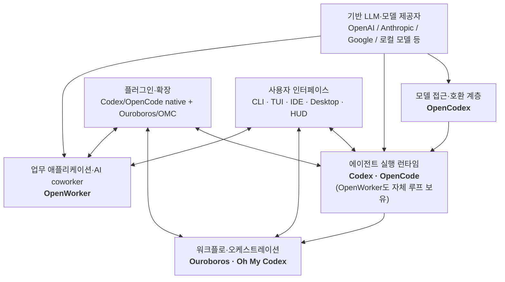

# LLM에서 신뢰할 수 있는 작업 시스템으로

**Codex·OpenCode·Ouroboros·OpenCodex·Oh My Codex·OpenWorker 심층 비교**

> 조사 기준일: **2026-07-26 (KST)**
> 분석 대상은 각 저장소의 기준일 현재 기본 브랜치다. 코드 인용은 재현성을 위해 조사 시점 커밋에 고정했다. 스타·포크 수는 생태계 규모를 보여 주는 보조 신호일 뿐, 품질 순위로 사용하지 않았다.

## 읽는 법과 증거 수준

- **[사실]** 저장소 코드, 공식 문서, 릴리스, 이슈에서 직접 확인한 내용이다.
- **[프로젝트 주장]** 프로젝트가 README나 홈페이지에서 내세우지만, 본 조사만으로 효과까지 독립 검증하지 못한 내용이다.
- **[해석]** 위 사실을 바탕으로 한 분석자의 판단이다.
- **[확인 필요]** 문서·구현이 어긋나거나 운영 데이터가 없어 추가 검증이 필요한 내용이다.

“기능이 있다”는 말은 세 가지로 나눠 보았다. 문서에만 적힌 **표방**, 코드 경로와 테스트가 있는 **구현**, 장기간 실제 환경에서 검증된 **운영 성숙도**는 서로 다르다. 특히 빠르게 변하는 프로젝트의 숫자와 기능 상태는 이 보고서의 스냅샷 이후 달라질 수 있다.

> **라벨 적용 규칙:** 인접 출처로 확인되는 기술·활동 정보는 **[사실]**, 제작자가 내세우는 효과·문제 정의는 **[프로젝트 주장]**이다. 점수, 성숙도, 관계, 장단점, 적합성, 최종 결론을 포함한 비교표와 종합 절은 표 전체가 **[해석]**이다. 표의 모든 셀에 라벨을 반복하지 않고 이 규칙을 일괄 적용한다. 근거가 충돌하거나 운영 검증이 없으면 **[확인 필요]**를 붙였다.

---

## 1. Executive Summary

### 한 문장 결론

이 여섯 프로젝트의 공통 전제는 **좋은 모델만으로는 일을 끝낼 수 없으며, 모델 주위에 환경 관측·도구 실행·상태 지속·정책·검증·복구·사용자 인터페이스라는 제어 평면이 필요하다**는 것이다. 다만 여섯 프로젝트는 같은 제품을 복제하지 않는다. 서로 다른 실패 지점에 개입한다.

- **Codex와 OpenCode**는 모델을 실제 저장소와 도구에 연결하는 **에이전트 실행 런타임**에서 직접 경쟁한다.
- **Ouroboros와 Oh My Codex(이하 OMC)**는 실행기보다 위에서 요구사항, 계획, 평가, 반복, 팀 실행을 조직하는 **워크플로·오케스트레이션 계층**이다. 전자는 런타임 독립적이고 명세 중심이며, 후자는 Codex에 특화되고 운영 UX가 강하다.
- **OpenCodex**는 Codex를 대체하지 않고 Codex와 여러 모델 제공자 사이의 프로토콜을 번역하는 **호환 프록시**다.
- **OpenWorker**는 코딩 에이전트가 아니라 파일·브라우저·SaaS를 다루는 **로컬 우선 AI coworker**다. 자체 에이전트 루프를 포함하지만 목표 시장은 지식 노동이다.

### 핵심 비교표 [해석]

| 프로젝트 | 정체성·주 계층 | 가장 중요하게 보는 실패 | 핵심 메커니즘 | Codex와의 관계 | 기준일 성숙도 판단 | 가장 큰 장점 | 가장 큰 위험·한계 |
|---|---|---|---|---|---|---|---|
| **OpenAI Codex** | 코딩 에이전트 런타임과 다중 UI | 모델이 저장소·터미널·도구를 안전하게 관측하고 수정하지 못함 | Rust 기반 도구 루프, OS 샌드박스와 승인 분리, 세션·압축, MCP·Skills·플러그인, 서브에이전트 | Codex 자체 | 대규모·고활동, 빠른 변화 | 보안 경계와 실행 하네스의 통합도가 가장 높음 | OpenAI 중심 최적화, 거대한 변화면, 장기·다중 실행 비용 |
| **OpenCode** | 공급자 독립 코딩 에이전트 런타임 | 특정 모델·서비스와 인터페이스에 종속됨 | 클라이언트/서버 세션, 다수 provider adapter, TUI·Desktop, 에이전트·도구·플러그인·MCP | 직접 대체재 | 대규모·고활동 | 공급자 선택권과 해킹 가능성 | 권한 UI는 보안 샌드박스가 아님; 호환성 정규화 부담 |
| **Ouroboros** | 명세 우선, 교차 런타임 Agent OS·워크플로 | 모호한 요구와 장기 실행이 검증 가능한 완료로 수렴하지 않음 | Interview→Seed→Execute→Evaluate→Evolve, AC 트리, 이벤트·체크포인트, 런타임 어댑터 | Codex를 실행자로 쓸 수 있는 상위 계층 | 젊지만 구현·테스트가 상당함, 매우 빠른 진화 | 요구사항과 평가를 실행의 일급 상태로 만듦 | 설정·개념·토큰 비용, 런타임 간 기능 동등성 없음 |
| **OpenCodex** | Codex용 모델 호환·라우팅 프록시 | Codex의 하네스를 유지하면서 다른 모델·계정을 쓰기 어려움 | Responses API↔Anthropic/Google/Azure/OpenAI/Chat 번역, 계정 풀·라우팅·대시보드 | 모델 호환·프록시 계층 | 매우 초기, 초고속 릴리스 | 하네스와 모델 선택을 분리 | 프로토콜 호환이 의미론적 동등성을 보장하지 않음 |
| **Oh My Codex** | Codex 특화 워크플로·팀 실행 확장 | Codex 단독 사용은 요구 구체화, 지속 상태, 팀 운영 의식이 약함 | deep-interview→ralplan→ultragoal, `.omx` 상태, hooks, tmux/worktree 팀, HUD | Codex 위 확장·오케스트레이션 | 활발한 초기~성장 단계 | Codex 중심의 반복 가능한 운영 경험 | native Codex와 기능 중복, 상태기계·tmux 복잡성, 위험한 full-access 편의 경로 |
| **OpenWorker** | 로컬 우선 범용 업무 수행 플랫폼 | 채팅 모델이 여러 앱을 넘나드는 실제 산출물과 비동기 업무를 완수하지 못함 | Desktop+로컬 서버, connector/MCP, durable session, approval inbox, self-wake, audit | 더 넓은 업무 플랫폼; 직접 관계 없음 | 공개 베타, 저장소가 매우 젊음 | 비개발 업무·외부 서비스·중단/재개의 통합 | connector 권한·프롬프트 주입·감사 경계, 운영 성숙도 미검증 |

### 가장 중요한 판단 다섯 가지

1. **지금의 차별화는 모델보다 하네스와 제어 평면에 더 많이 있다.** 모델 성능은 가능한 품질의 상한을 정하지만, 실제 완료율은 컨텍스트 선택, 도구 계약, 권한, 상태, 검증, 복구가 좌우한다.
2. **“멀티 에이전트”는 그 자체로 해결책이 아니다.** 품질을 결정하는 것은 에이전트 수가 아니라 작업 분할의 독립성, 쓰기 소유권, 공유 상태, 결과 병합, 최종 검증이다.
3. **호환성과 동등성은 다르다.** OpenCodex나 Ouroboros의 adapter가 요청을 전달할 수 있어도 reasoning item, tool call, permission, compaction, subagent 의미가 원 런타임과 같다는 뜻은 아니다.
4. **승인, 샌드박스, worktree는 서로 대체할 수 없다.** 승인은 사용자의 의사결정, 샌드박스는 OS 수준 능력 제한, worktree는 파일 충돌 완화다. OpenCode도 공식 보안 문서에서 자체 permission이 보안 격리가 아니라고 명시한다.
5. **모델이 좋아져도 남는 구조가 있다.** 외부 효과의 승인·감사, 재현 가능한 상태 전이, 조직 정책, 인수 조건, 비용 예산, 장애 복구는 추론 성능 향상만으로 사라지지 않는다.

### 선택을 먼저 요약하면

| 상황 | 우선 검토 |
|---|---|
| OpenAI 모델과 강한 로컬 실행·보안 기본값으로 저장소 작업 | **Codex** |
| 여러 모델 제공자와 오픈 런타임을 직접 선택·개조 | **OpenCode** |
| 요구사항을 검증 가능한 명세로 고정하고 여러 런타임으로 장기 실행 | **Ouroboros** |
| Codex 하네스는 유지하되 모델·계정·프로토콜을 바꾸기 | **OpenCodex** |
| Codex에 면접·계획·팀 실행·HUD·지속 상태를 더하기 | **OMC** |
| 코딩보다 문서·파일·브라우저·SaaS를 아우르는 로컬 업무 자동화 | **OpenWorker** |

조합도 가능하다. 예를 들어 `Ouroboros → Codex`, `OMC → Codex`, `Codex → OpenCodex → 외부 모델`은 각각 유효한 상하위 구성이다. 그러나 계층을 더할수록 장애 위치, 권한 의미, 로그 상관관계, 버전 호환을 추적하는 비용이 함께 증가한다.

---

## 2. 조사 범위, 저장소 검증, 이름 혼동

### 공식·주 저장소 확인

| 요청 URL | 판정 | 근거와 혼동 가능성 |
|---|---|---|
| [`openai/codex`](https://github.com/openai/codex) | **맞음 — 공식 주 저장소** | OpenAI 조직 소유이며 README가 OpenAI의 로컬 코딩 에이전트와 공식 문서로 연결한다. “Codex”라는 이름은 다른 편집기·도구에도 쓰이므로 소유자 `openai`를 함께 표기해야 한다. |
| [`anomalyco/opencode`](https://github.com/anomalyco/opencode) | **맞음 — 현재 공식 주 저장소** | 공식 사이트 `opencode.ai`와 패키지·문서가 이 저장소로 연결된다. [`opencode-ai/opencode`](https://github.com/opencode-ai/opencode)는 별개의 **archived** 저장소이므로 검색 결과에서 혼동하기 쉽다. |
| [`Q00/ouroboros`](https://github.com/Q00/ouroboros) | **맞음 — 본 보고서 대상 Agent OS의 주 저장소** | 공식 문서는 `Q00/ouroboros`를 코어, `Q00/ourocode`를 UI, `Q00/ouroboros-plugins`를 확장 생태계로 설명한다. Docker updater, 자기생성 에이전트 등 “Ouroboros” 동명 프로젝트가 많아 `Q00` 표기가 필수다. |
| [`lidge-jun/opencodex`](https://github.com/lidge-jun/opencodex) | **맞음 — 요청에서 말한 provider proxy의 주 저장소** | `opencodex.me` 및 npm `@bitkyc08/opencodex`와 연결된다. `RyensX/OpenCodex`, `AITabby/opencodex`, `thyjeff/opencodex` 등 같은 이름의 다른 목적 프로젝트가 있어 “유일한 OpenCodex”는 아니다. OpenAI 공식 프로젝트도 아니다. |
| [`Yeachan-Heo/oh-my-codex`](https://github.com/Yeachan-Heo/oh-my-codex) | **맞음 — 공식·원본 저장소** | README가 이 경로를 official/original이라고 명시한다. archived fork인 `scalarian/oh-my-codex` 등과 혼동하지 않아야 한다. |
| [`andrewyng/openworker`](https://github.com/andrewyng/openworker) | **맞음 — 본 보고서 대상 AI coworker의 주 저장소** | README와 `openworker.com`이 연결된다. `openworkers/*` 런타임 생태계나 게임 서버 에뮬레이터 `SpaceAfterYou/OpenWorker`와는 다른 프로젝트다. |

따라서 요청에 포함된 URL은 모두 수정할 필요가 없다. 다만 **OpenCode·Ouroboros·OpenCodex·OpenWorker는 이름만으로 검색하면 다른 프로젝트가 섞이므로 owner/repo를 식별자로 사용해야 한다.**

### 기준일 활동 스냅샷

아래 수치는 품질 점수가 아니라 규모와 변화 속도를 읽기 위한 맥락이다. **[사실]** 생성일·star·fork는 각 프로젝트 셀에 연결한 GitHub metadata의 2026-07-26 스냅샷이고, 릴리스 날짜는 고정 tag 링크에서 확인했다. GitHub의 `open_issues_count`는 pull request도 포함할 수 있어 결함 수로 사용하지 않았다. 마지막 열은 이 활동을 해석한 **[해석]**이다.

| 프로젝트 | 저장소 생성 | 조사 커밋 | 최신 릴리스 | 공개 규모·활동 단서 | 해석 |
|---|---:|---|---|---|---|
| [Codex metadata](https://api.github.com/repos/openai/codex) | 2025-04-13 | [`322d5b9`](https://github.com/openai/codex/tree/322d5b96cfa5c8fd52bd83ecfdb79cd9b330205f) | [`rust-v0.145.0`](https://github.com/openai/codex/releases/tag/rust-v0.145.0), 2026-07-21 | 약 101k stars, 15k forks, 매우 빈번한 release·commit | 제품·저장소 모두 대규모이나 변화 속도도 매우 높음 |
| [OpenCode metadata](https://api.github.com/repos/anomalyco/opencode) | 2025-04-30 | [`7534d23`](https://github.com/anomalyco/opencode/tree/7534d23551f665e65080809975b4ca5c7d63807b) (`dev`) | [`v1.18.5`](https://github.com/anomalyco/opencode/releases/tag/v1.18.5), 2026-07-24 | 약 190k stars, 24k forks, 매우 빈번한 release·commit | 큰 생태계와 넓은 제품 면; 안정성은 기능별 확인 필요 |
| [Ouroboros metadata](https://api.github.com/repos/Q00/ouroboros) | 2026-01-14 | [`639e8a9`](https://github.com/Q00/ouroboros/tree/639e8a9335ca285ded409cdade5fcb32b92b3791) | [`v0.50.6`](https://github.com/Q00/ouroboros/releases/tag/v0.50.6), 2026-07-24 | 약 5.2k stars, 518 forks, 생성 이후 빠른 release | 매우 젊지만 코드·테스트 면적이 큼; 설계와 구현이 계속 이동 |
| [OpenCodex metadata](https://api.github.com/repos/lidge-jun/opencodex) | 2026-06-18 | [`b0413c6`](https://github.com/lidge-jun/opencodex/tree/b0413c6e18522232d42d23b58c420c335ea881ee) | [`v2.7.40`](https://github.com/lidge-jun/opencodex/releases/tag/v2.7.40), 2026-07-25 | 약 4.8k stars, 358 forks, 5주 동안 매우 잦은 release | 구현량은 많으나 장기간 호환·운영 성숙도는 아직 판단 불가 |
| [OMC metadata](https://api.github.com/repos/Yeachan-Heo/oh-my-codex) | 2026-02-02 | [`435d4a9`](https://github.com/Yeachan-Heo/oh-my-codex/tree/435d4a9cc982ffaf83fabbfbb8711ae6c178ffca) | [`v0.20.3`](https://github.com/Yeachan-Heo/oh-my-codex/releases/tag/v0.20.3), 2026-07-19 | 약 32k stars, 2.5k forks, 빠른 release·issue 처리 | 빠르게 성장하는 Codex 특화 확장; upstream 중복과 운영 복잡성 관찰 필요 |
| [OpenWorker metadata](https://api.github.com/repos/andrewyng/openworker) | 2026-07-20 | [`db93d75`](https://github.com/andrewyng/openworker/tree/db93d75bf634e3a855b29e00d8f5d677438cac1f) | [`v0.1.6`](https://github.com/andrewyng/openworker/releases/tag/v0.1.6), 2026-07-23 | 약 4.5k stars, 599 forks, 공식 표기는 공개 베타 | 코드·테스트는 상당하지만 공개된 지 1주 미만인 극초기 프로젝트 |

두 가지 포장상 주의점이 있다. **[사실]** OMC README는 MIT라고 쓰지만 기준일 저장소 루트에서 `LICENSE` 파일과 GitHub 라이선스 인식이 확인되지 않았다. **[사실]** OpenWorker의 릴리스는 `v0.1.6`이지만 `pyproject.toml` 내부 패키지 버전은 아직 `0.0.0`이다. 둘 다 기능 결함을 뜻하지는 않지만 배포·법무 성숙도를 별도로 확인해야 하는 신호다.

---

## 3. 분석 관점: LLM에서 작업 시스템으로

### 왜 “추론”과 “작업 완료”는 다른가

LLM 호출은 대략 `출력 = 모델(현재 입력)`이다. 반면 작업 시스템은 다음 폐루프를 지속해야 한다.

```text
목표 구체화
  → 환경 관측과 관련 컨텍스트 선택
  → 계획·행동 결정
  → 도구 실행과 외부 상태 변경
  → 결과 관측
  → 검증
  → 실패 분류·복구 또는 사용자 승인
  → 완료 증거와 상태 보존
```

순수 LLM은 파일 시스템의 최신 상태, 이전 프로세스의 결과, OAuth 권한, 명령의 실제 부작용을 스스로 알 수 없다. 컨텍스트 창 밖의 진행 상태도 보존하지 않으며, “완료했다”는 문장과 테스트를 통과한 산출물을 구분해 주지 않는다. 따라서 실용적 에이전트는 다음 네 종류의 외부 구조를 필요로 한다.

1. **감각과 행동:** 파일·터미널·브라우저·SaaS를 구조화된 도구 계약으로 노출한다.
2. **지속성과 제어:** 세션, 이벤트, 체크포인트, 예산, 취소, 재개를 모델 밖에 둔다.
3. **정책과 안전:** 승인, 권한, 격리, 감사, 비밀 관리로 가능한 행동을 제한한다.
4. **완료의 정의:** 명세, 인수 조건, 테스트, 평가, 리뷰를 통해 자기보고와 실제 성공을 분리한다.

### 포지셔닝 지도



경계는 완전히 깔끔하지 않다. Codex와 OpenCode도 플러그인·UI·멀티 에이전트를 포함하고, Ouroboros와 OMC도 실행 상태와 UI를 갖는다. OpenWorker는 애플리케이션이면서 자체 agent loop다. 이 지도는 “기능 보유 여부”보다 **주된 실패를 어디에서 해결하는가**를 기준으로 배치한 것이다.

---

## 4. 프로젝트별 분석

### 4.1 OpenAI Codex

#### 정체성

**한 문장 정의:** OpenAI 모델을 기본 두뇌로 삼아 로컬 저장소와 터미널에서 계획·수정·실행·검증을 수행하는, 보안 경계를 포함한 범용 코딩 에이전트 런타임이다.

**[사실]** 공식 README는 CLI, IDE, App, Web 표면을 제시한다. 기준 커밋의 Rust 모노레포에는 `core`, `state`, `rollout`, `app-server`, `exec-server`, `execpolicy`, `sandboxing`, `linux-sandbox`, `mcp`, `skills`, `plugins`, `hooks`, `memories`, `agent-graph-store` 등이 존재한다([README](https://github.com/openai/codex/blob/322d5b96cfa5c8fd52bd83ecfdb79cd9b330205f/README.md), [codex-rs](https://github.com/openai/codex/tree/322d5b96cfa5c8fd52bd83ecfdb79cd9b330205f/codex-rs)). 즉 “CLI에 프롬프트를 붙인 것”이 아니라 실행·정책·상태·프로토콜을 포함한 플랫폼이다.

대표 사용자는 OpenAI 모델의 코딩 성능과 기본 도구 체계를 선호하면서, 별도 오케스트레이터 없이 저장소 단위 작업을 빠르게 위임하려는 개인과 팀이다. `AGENTS.md`, Skills, MCP, 플러그인과 설정을 이용하면 조직 규칙도 일부 코드 가까이에 둘 수 있다.

#### 실패 → 원인 가설 → 개입

- **관찰한 실패:** 채팅 모델은 현재 저장소를 충분히 탐색하지 않고, 실제 명령 결과와 파일 변화를 잊으며, 위험한 행동과 안전한 행동을 안정적으로 구별하지 못한다. 긴 작업에서는 컨텍스트가 팽창하고 완료 여부가 모호해진다.
- **명시적 문제 주장 [프로젝트 주장]:** README와 공식 문서는 Codex를 로컬 저장소에서 코드를 읽고 바꾸고 실행하는 coding agent로 정의하며, sandbox와 approval을 작업 안전의 별도 축으로 제시한다([README](https://github.com/openai/codex/blob/322d5b96cfa5c8fd52bd83ecfdb79cd9b330205f/README.md), [sandbox 구현](https://github.com/openai/codex/tree/322d5b96cfa5c8fd52bd83ecfdb79cd9b330205f/codex-rs/sandboxing)).
- **구조에서 추론한 원인 [해석]:** 모델 호출과 운영체제 사이에 표준화된 도구 루프, 지속 세션, 실행 정책, 검증·리뷰 표면이 없기 때문이다.
- **선택한 해결 방식:** 모델을 도구 호출 루프 안에 넣고, 세션·rollout을 기록하며, OS 샌드박스와 승인 정책을 별도 제어축으로 둔다. 작업이 커지면 계획·압축·서브에이전트·리뷰를 사용한다.
- **개입하는 시스템 계층:** 에이전트 런타임, 로컬 실행 격리, 프로토콜, 사용자 인터페이스, 확장 생태계.
- **새롭게 발생하는 비용 또는 복잡성:** 거대한 런타임과 설정 표면, OpenAI API·제품 변화와의 결합, 더 많은 tool turn과 subagent가 만드는 토큰·지연·충돌 비용.
- **문제 범주:** 개인의 안전한 작업 실행과 팀의 반복 규칙이 중심이며, OpenAI 중심 최적화 때문에 벤더 선택 문제도 일부 포함한다.

#### 해결 메커니즘

1. **도구 실행과 상태.** `core`가 대화·도구 라우팅을, `state`와 rollout 관련 crate가 세션 지속을 담당하며 app server가 여러 UI에 공통 런타임을 제공한다. 도구 결과가 다시 모델 입력이 되는 폐루프가 제품의 중심이다([core](https://github.com/openai/codex/tree/322d5b96cfa5c8fd52bd83ecfdb79cd9b330205f/codex-rs/core), [state](https://github.com/openai/codex/tree/322d5b96cfa5c8fd52bd83ecfdb79cd9b330205f/codex-rs/state), [app-server](https://github.com/openai/codex/tree/322d5b96cfa5c8fd52bd83ecfdb79cd9b330205f/codex-rs/app-server)).
2. **컨텍스트 압축.** 상태가 모델 창을 넘기 전에 대화를 요약하는 compaction 경로와 자동 압축 상태가 코드에 있다. 이는 무한 기억이 아니라, 원문 일부를 손실 있는 요약으로 치환하는 예산 관리다([compact request](https://github.com/openai/codex/blob/322d5b96cfa5c8fd52bd83ecfdb79cd9b330205f/codex-rs/core/src/compact_remote_request.rs)).
3. **샌드박스와 승인 분리.** 공식 문서는 sandbox가 기술적으로 가능한 자원 범위를, approval이 그 범위 밖 행동을 사용자에게 묻는 시점을 정한다고 구분한다. 일반적인 non-Windows configured project 기본은 restricted network와 workspace write이고, project trust 상태가 미결정이거나 Windows sandbox가 비활성인 조건에서는 read-only로 fallback한다. 실행 정책 crate와 OS별 sandbox 구현은 OpenCode와의 핵심 차이다([permission defaults](https://github.com/openai/codex/blob/322d5b96cfa5c8fd52bd83ecfdb79cd9b330205f/codex-rs/core/src/config/permissions.rs), [sandboxing](https://github.com/openai/codex/tree/322d5b96cfa5c8fd52bd83ecfdb79cd9b330205f/codex-rs/sandboxing), [execpolicy](https://github.com/openai/codex/tree/322d5b96cfa5c8fd52bd83ecfdb79cd9b330205f/codex-rs/execpolicy)).
4. **서브에이전트.** 현재 Codex는 기본 `default`, `worker`, `explorer` 역할과 사용자 정의 agent를 지원하고, 주 스레드에는 결과 요약을 돌려준다. 각 agent는 권한·sandbox를 상속하며, 동시 쓰기 충돌과 토큰 증가가 명시적 비용이다([공식 Codex 문서: multi-agent](https://developers.openai.com/codex/multi-agent/)).
5. **확장.** MCP는 외부 도구·서비스, Skills는 재사용 가능한 절차·지식, hooks와 plugins는 실행 생명주기와 배포 단위를 제공한다. 확장이 많아질수록 신뢰할 코드의 범위도 커진다([mcp-server](https://github.com/openai/codex/tree/322d5b96cfa5c8fd52bd83ecfdb79cd9b330205f/codex-rs/mcp-server), [skills](https://github.com/openai/codex/tree/322d5b96cfa5c8fd52bd83ecfdb79cd9b330205f/codex-rs/skills), [plugin](https://github.com/openai/codex/tree/322d5b96cfa5c8fd52bd83ecfdb79cd9b330205f/codex-rs/plugin)).
6. **검증.** 테스트 실행은 일반 도구 루프에서 수행되고, 자동 review는 작업 경계에서 별도 reviewer가 결과를 비판하는 구조다. 그러나 인수 조건 자체를 자동으로 올바르게 만드는 것은 아니므로 좋은 요구와 저장소 테스트가 여전히 필요하다.

표준 thread는 JSONL rollout을 정본으로, SQLite를 검색·metadata 계층으로 사용한다([thread store](https://github.com/openai/codex/blob/322d5b96cfa5c8fd52bd83ecfdb79cd9b330205f/codex-rs/thread-store/README.md)). 교차 session memory pipeline도 존재하지만 기준일에는 실험 기능이고 모델이 추출·통합한 손실성 기억이다([memories](https://github.com/openai/codex/blob/322d5b96cfa5c8fd52bd83ecfdb79cd9b330205f/codex-rs/memories/README.md)). “지속 저장”과 “정확한 장기 기억”을 동일시하면 안 된다.

#### 설계 선택과 트레이드오프

| 선택 | 얻는 것 | 잃는 것·주의점 |
|---|---|---|
| OpenAI 중심의 긴밀한 통합 | 모델 기능과 도구 프로토콜의 빠른 공동 최적화 | 타 provider에서 동일한 reasoning/tool semantics가 보장되지 않음 |
| OS sandbox + approval | 편의 설정과 실제 격리를 분리한 강한 기본 구조 | full access를 켜면 경계가 사라지고, MCP 외부 효과는 별도 정책이 필요 |
| 자율 도구 루프 | 작은 지시로 탐색→수정→검증까지 진행 | 긴 루프가 잘못된 가설을 증폭할 수 있어 중간 관찰·테스트가 필요 |
| native subagents | 조사·검증·독립 모듈 작업 병렬화 | 분할 불량, 공유 파일 쓰기, 결과 병합이 새로운 실패 모드 |
| 다중 UI와 확장 생태계 | 개인 CLI부터 조직 워크플로까지 같은 코어 재사용 | 제품 면적이 커져 버전·설정·문서가 빠르게 어긋날 수 있음 |

**[확인 필요] 문서와 HEAD 차이:** 공식 문서는 custom provider와 Responses/Chat Completions 구성을 설명하지만 기준 커밋의 `model-provider-info`는 `WireApi::Responses`만 허용하고 `wire_api="chat"`을 제거된 값으로 처리한다([구현](https://github.com/openai/codex/blob/322d5b96cfa5c8fd52bd83ecfdb79cd9b330205f/codex-rs/model-provider-info/src/lib.rs)). 따라서 “provider 설정 가능”을 OpenCode 수준의 광범위한 native adapter 동등성으로 해석하면 안 된다.

#### Codex와의 관계, 단독 사용 시 판단

분류는 **Codex 자체**다. 이것만으로 충분한 경우는 코드 저장소가 작업의 중심이고, OpenAI 모델 선택을 수용하며, 요구가 비교적 명확하고, `AGENTS.md`·Skills·테스트로 반복 규칙을 표현할 수 있을 때다. 반대로 provider 독립성, 강제된 명세 승인·평가 루프, 장기 캠페인 재생, Codex 특화 팀 운영 의식, 비개발 SaaS 업무가 핵심이면 각각 OpenCode/OpenCodex, Ouroboros, OMC, OpenWorker가 추가 가치를 준다.

---

### 4.2 OpenCode

#### 정체성

**한 문장 정의:** 다수 모델 제공자를 한 agent runtime과 세션·도구·UI 아래 정규화하는 오픈소스 코딩 에이전트다.

**[사실]** README는 터미널 UI와 beta desktop을 제시하고, 기본 `build`(전체 도구), `plan`(읽기 중심), `general` subagent를 설명한다([README](https://github.com/anomalyco/opencode/blob/7534d23551f665e65080809975b4ca5c7d63807b/README.md)). 저장소에는 CLI/server/client/TUI/desktop/web/provider/plugin/SDK가 함께 있으며 core는 event-driven client/server로 구성된다([packages](https://github.com/anomalyco/opencode/tree/7534d23551f665e65080809975b4ca5c7d63807b/packages)).

대표 사용자는 특정 모델 회사에 작업 환경 전체를 묶고 싶지 않거나, 오픈 런타임을 직접 수정하고, 같은 UX에서 여러 provider·로컬 모델을 비교하려는 개발자다. Codex와 가장 직접적으로 겹치는 대체재다.

#### 실패 → 원인 가설 → 개입

- **관찰한 실패:** 코딩 에이전트의 좋은 UX와 provider 선택이 한 제품에 묶이고, provider마다 인증·메시지·tool call·오류 형식이 다르다.
- **명시적 문제 주장 [프로젝트 주장]:** README와 provider 문서는 특정 모델에 고정되지 않은 open-source coding agent와 폭넓은 provider 선택을 핵심 가치로 제시한다([README](https://github.com/anomalyco/opencode/blob/7534d23551f665e65080809975b4ca5c7d63807b/README.md), [provider docs](https://github.com/anomalyco/opencode/blob/7534d23551f665e65080809975b4ca5c7d63807b/packages/web/src/content/docs/providers.mdx)).
- **구조에서 추론한 원인 [해석]:** 모델 접근, agent behavior, 도구, UI가 독점적인 단일 스택으로 결합되어 있기 때문이다.
- **선택한 해결 방식:** provider adapter와 모델 카탈로그 위에 공통 session/event/tool/agent/plugin 계층을 두고, TUI·Desktop·SDK가 같은 서버를 사용하게 한다.
- **개입하는 시스템 계층:** 모델 추상화, agent runtime, UI, 확장 계층.
- **새롭게 발생하는 비용 또는 복잡성:** provider별 의미 차이를 가장 낮은 공통분모나 예외 처리로 흡수해야 하고, 자체 permission은 OS 보안 경계가 아니며, 플러그인 코드까지 신뢰 표면이 넓어진다.
- **문제 범주:** 개인·플랫폼 팀의 모델 선택 문제이자 명시적인 벤더 종속 문제다.

#### 해결 메커니즘

1. **역할별 agent.** 구현에는 `build`, `plan`, `general`, `explore`와 숨은 `compaction`, `title`, `summary` agent가 있다. 각 agent는 모델, 프롬프트, mode, permission을 달리할 수 있다([agent.ts](https://github.com/anomalyco/opencode/blob/7534d23551f665e65080809975b4ca5c7d63807b/packages/opencode/src/agent/agent.ts)).
2. **세션과 압축.** compaction은 최근 turn을 예산 안에 보존하고 오래된 큰 tool output을 먼저 prune한 뒤 숨은 compaction agent로 요약한다. 실패는 provider error 종류에 따라 지수 backoff로 재시도한다([compaction.ts](https://github.com/anomalyco/opencode/blob/7534d23551f665e65080809975b4ca5c7d63807b/packages/opencode/src/session/compaction.ts), [retry.ts](https://github.com/anomalyco/opencode/blob/7534d23551f665e65080809975b4ca5c7d63807b/packages/opencode/src/session/retry.ts)).
3. **permission rule engine.** wildcard가 있는 ordered `allow/ask/deny` 규칙을 평가하고 session 동안 “always” 승인을 기억한다([permission](https://github.com/anomalyco/opencode/blob/7534d23551f665e65080809975b4ca5c7d63807b/packages/opencode/src/permission/index.ts)). 그러나 이것은 사용자에게 의도를 보여 주는 정책 UX다.
4. **subagent task.** child session을 만들고 기본 깊이 제한을 두며 foreground/background 실행을 지원한다. 기준일 background subagent는 experimental flag가 필요하고, 완료 결과를 부모 session으로 주입한다([task.ts](https://github.com/anomalyco/opencode/blob/7534d23551f665e65080809975b4ca5c7d63807b/packages/opencode/src/tool/task.ts)).
5. **provider 추상화.** 여러 AI SDK provider, 인증 플러그인, model transformation을 한 registry에서 구성한다. 넓은 선택권의 대가로 provider capability 탐지와 메시지 변환이 핵심 유지보수 업무가 된다([provider.ts](https://github.com/anomalyco/opencode/blob/7534d23551f665e65080809975b4ca5c7d63807b/packages/opencode/src/provider/provider.ts)).
6. **plugin·MCP·Skills.** 외부 plugin을 구성 순서대로 등록하고 `trigger` 계열 hook은 직렬 await하지만, generic `event` hook은 fire-and-forget이므로 완료·부작용 순서까지 보장되지는 않는다. MCP와 skill도 agent에 노출한다([plugin index](https://github.com/anomalyco/opencode/blob/7534d23551f665e65080809975b4ca5c7d63807b/packages/opencode/src/plugin/index.ts)).
7. **snapshot과 undo.** 모델 단계 전후 Git 기반 snapshot·diff를 만들고 restore/revert, `/undo`, `/redo`를 제공한다. 이는 OpenCode의 실용적 복구 장점이지만 정확성 검증이나 OS 격리는 아니다([snapshot](https://github.com/anomalyco/opencode/blob/7534d23551f665e65080809975b4ca5c7d63807b/packages/opencode/src/snapshot/index.ts)).

#### 가장 중요한 보안 차이

**[사실]** OpenCode의 공식 `SECURITY.md`는 agent를 sandbox하지 않으며 permission system이 보안 격리가 아니라 사용자 인지·동의를 위한 것이라고 명시한다([SECURITY.md](https://github.com/anomalyco/opencode/blob/7534d23551f665e65080809975b4ca5c7d63807b/SECURITY.md)). session 명세도 bash가 현재 사용자와 같은 파일·프로세스·네트워크 권한을 가진다고 설명한다([session spec](https://github.com/anomalyco/opencode/blob/7534d23551f665e65080809975b4ca5c7d63807b/specs/v2/session.md)).

따라서 UI에 표시되는 “permission”이나 “sandbox/worktree”라는 용어를 Codex의 OS-enforced sandbox와 같은 것으로 보면 안 된다. worktree는 작업 복사본을 격리해 충돌을 줄이지만, 프로세스가 홈 디렉터리나 네트워크에 접근하지 못하게 하는 보안 경계가 아니다.

문서·코드 차이도 있다. **[사실]** README는 Plan을 read-only이며 bash 전에 질문하는 mode로 묘사하지만 기준일 정책은 상위 `* allow`를 상속하고 일반 edit만 deny하며 계획 파일 쓰기를 허용한다. shell을 별도 `ask`로 바꾸는 규칙도 확인되지 않는다([README](https://github.com/anomalyco/opencode/blob/7534d23551f665e65080809975b4ca5c7d63807b/README.md#L100-L110), [agent policy](https://github.com/anomalyco/opencode/blob/7534d23551f665e65080809975b4ca5c7d63807b/packages/opencode/src/agent/agent.ts#L119-L180)). permission 문서의 `.env` 기본 `deny`와 코드의 `ask`도 어긋난다([문서](https://github.com/anomalyco/opencode/blob/7534d23551f665e65080809975b4ca5c7d63807b/packages/web/src/content/docs/permissions.mdx#L168-L185)). 따라서 보안 판단은 설명 문구보다 현재 정책 코드와 실제 process 권한을 기준으로 해야 한다.

또한 background child registry는 process-local·비지속적이다([background job](https://github.com/anomalyco/opencode/blob/7534d23551f665e65080809975b4ca5c7d63807b/packages/core/src/background-job.ts#L113-L120)). “background 지원”을 durable scheduler로 해석하면 안 된다.

#### 설계 선택과 트레이드오프

| 선택 | 얻는 것 | 잃는 것·주의점 |
|---|---|---|
| 넓은 provider 지원 | 가격·성능·프라이버시·로컬 모델 선택 | capability parity와 오류 의미를 adapter가 계속 추적해야 함 |
| client/server + event | CLI·Desktop·SDK가 한 세션 모델 공유, 관찰성 향상 | 분산 상태·버전 호환·background lifecycle 복잡성 |
| configurable agent/plugin | 특정 팀 흐름에 맞춘 높은 확장성 | 신뢰 경계와 디버깅 경로가 길어짐 |
| permission UX | 사용자가 중요한 행동을 볼 수 있음 | 악성·오판 명령을 기술적으로 격리하지 못함 |
| 모델이 계획·분해 | 빠른 시작, 사전 스키마가 적음 | 장기 프로젝트의 명세·인수 조건·재생성은 별도 계층이 필요 |

#### Codex와의 관계

분류는 **Codex의 직접 대체재**다. Codex 대신 얻는 것은 provider 독립성, 오픈 client/server 구조, 광범위한 조정 가능성이다. 잃는 것은 OpenAI 모델과 하네스의 공동 최적화, Codex의 OS sandbox 기본 구조, 일부 공식 제품 표면과 조직 지원이다. “어떤 모델도 연결된다”는 사실만으로 “모든 모델이 같은 tool-use 품질을 낸다”는 결론은 나오지 않으므로, 실제 후보 모델별 tool-call·long-context·retry 회귀 테스트가 필요하다.

---

### 4.3 Ouroboros (`Q00/ouroboros`)

#### 정체성

**한 문장 정의:** 모호한 아이디어를 불변 명세와 인수 조건으로 바꾸고, 여러 코딩 에이전트 런타임에서 실행·평가·재실행 가능하게 만드는 specification-first Agent OS다.

**[프로젝트 주장]** “Stop prompting. Start specifying.”라는 표어처럼, 출력 모델보다 입력 명확성이 현재 AI 코딩의 병목이라고 본다. 공식 스택은 코어 OS인 `Q00/ouroboros`, 사용자 수준 워크플로인 `Q00/ouroboros-plugins`, TUI shell인 `Q00/ourocode`로 나뉜다([README](https://github.com/Q00/ouroboros/blob/639e8a9335ca285ded409cdade5fcb32b92b3791/README.md)).

독립 코딩 모델이나 Codex 대체재가 아니다. Claude Code, Codex CLI, OpenCode, Hermes, Gemini, Kiro, Copilot, Pi, Zcode 같은 실행기를 아래에 두는 **상위 제어 평면**이다. 대표 사용 상황은 “무엇을 만들지부터 불명확한 큰 작업”, “중단·재개·감사가 필요한 장기 실행”, “동일 명세를 여러 runtime에서 실행하거나 결과를 비교할 때”다.

#### 실패 → 원인 가설 → 개입

- **관찰한 실패:** 한 줄 프롬프트로 시작한 작업은 숨은 가정이 뒤늦게 드러나고, 구현 중 목표가 이동하며, agent의 “끝났다”는 자기보고가 검증을 대신한다. 긴 실행은 중단되면 경위와 상태를 잃는다.
- **명시적 문제 주장 [프로젝트 주장]:** README는 “대부분의 AI coding 실패는 출력보다 입력에서 시작한다”며 vague prompt, no spec, manual QA를 핵심 문제로 든다([README의 Why 절](https://github.com/Q00/ouroboros/blob/639e8a9335ca285ded409cdade5fcb32b92b3791/README.md#L90-L99)).
- **구조에서 추론한 원인 [해석]:** 의도, 인수 조건, 실행 이벤트, 평가가 구조화된 외부 계약이 아니라 대화 안의 자연어로만 존재하기 때문이다.
- **선택한 해결 방식:** Socratic interview로 모호성을 드러내고, 목표·제약·acceptance criteria(AC)를 Seed로 동결한 뒤, AC 트리를 분해·실행하고 mechanical→semantic→조건부 consensus 평가를 통과시킨다. 이벤트 ledger와 checkpoint로 재개·감사를 가능하게 한다.
- **개입하는 시스템 계층:** 요구공학, 워크플로·오케스트레이션, 평가, 런타임 추상화, 플러그인 정책.
- **새롭게 발생하는 비용 또는 복잡성:** 사전 면접과 명세 작성 시간, 여러 agent/evaluator 호출의 토큰·지연, Seed schema와 상태기계 학습, adapter별 capability 차이, 점수의 거짓 정밀성 위험.
- **문제 범주:** 개인의 모호한 요구도 다루지만, 장기 작업의 인수 조건·감사·재생이라는 팀·조직 문제가 중심이며 runtime 교체라는 벤더 문제도 포함한다.

#### 해결 메커니즘

1. **Interview와 Seed 계약.** 답변을 목표·제약·ontology·AC가 있는 Seed로 만들고 실행 전에 계약을 검토한다. 한 Seed 객체는 frozen contract여서 실행 중 임의로 목표를 덮어쓰기 어렵지만, 진화 단계가 계보와 버전을 가진 후속 Seed를 만드는 것은 가능하다([Seed contract](https://github.com/Q00/ouroboros/blob/639e8a9335ca285ded409cdade5fcb32b92b3791/src/ouroboros/core/seed_contract.py), [Seed model](https://github.com/Q00/ouroboros/blob/639e8a9335ca285ded409cdade5fcb32b92b3791/src/ouroboros/core/seed.py)).
2. **분해와 실행.** 현재 실제 경로의 `parallel_executor.py`는 AC를 보수적으로 2~5개의 하위 AC로 나누고 깊이를 제한하며, 독립 항목을 병렬화하고 실패 피드백과 bounded retry를 관리한다([parallel executor](https://github.com/Q00/ouroboros/blob/639e8a9335ca285ded409cdade5fcb32b92b3791/src/ouroboros/orchestrator/parallel_executor.py)).
3. **이벤트와 체크포인트.** SQLite event store와 checkpoint가 모델 대화 밖에 실행 기록을 둔다. 재개는 “모델이 기억한다”가 아니라 마지막 확인된 전이에서 상태를 복원하는 문제로 바뀐다([event store](https://github.com/Q00/ouroboros/blob/639e8a9335ca285ded409cdade5fcb32b92b3791/src/ouroboros/persistence/event_store.py), [checkpoint](https://github.com/Q00/ouroboros/blob/639e8a9335ca285ded409cdade5fcb32b92b3791/src/ouroboros/persistence/checkpoint.py)).
4. **평가 파이프라인.** 먼저 lint/build/test 같은 mechanical evidence를 수집하고, 그다음 AC에 대한 semantic 평가를 수행하며, 조건에 따라 independent/consensus reviewer를 붙인다([pipeline](https://github.com/Q00/ouroboros/blob/639e8a9335ca285ded409cdade5fcb32b92b3791/src/ouroboros/evaluation/pipeline.py), [mechanical](https://github.com/Q00/ouroboros/blob/639e8a9335ca285ded409cdade5fcb32b92b3791/src/ouroboros/evaluation/mechanical.py), [semantic](https://github.com/Q00/ouroboros/blob/639e8a9335ca285ded409cdade5fcb32b92b3791/src/ouroboros/evaluation/semantic.py)). **[확인 필요]** mechanical command는 `.ouroboros/mechanical.toml`에 의존하고 생성 실패 시 Stage 1이 비어 있을 수 있으며, consensus도 항상 서로 다른 모델을 쓰는 것은 아니다([command policy](https://github.com/Q00/ouroboros/blob/639e8a9335ca285ded409cdade5fcb32b92b3791/src/ouroboros/evaluation/languages.py), [consensus](https://github.com/Q00/ouroboros/blob/639e8a9335ca285ded409cdade5fcb32b92b3791/src/ouroboros/evaluation/consensus.py)). 구조는 타당하지만 semantic score가 실제 사용자 만족과 얼마나 보정되는지는 별도 운영 데이터가 필요하다.
5. **runtime adapter와 capability negotiation.** `AgentRuntime`, 정규화된 message/handle/result, runtime factory와 parameter negotiation이 서로 다른 CLI를 공통 실행기로 감싼다([runtime factory](https://github.com/Q00/ouroboros/blob/639e8a9335ca285ded409cdade5fcb32b92b3791/src/ouroboros/orchestrator/runtime_factory.py), [parameter negotiation](https://github.com/Q00/ouroboros/blob/639e8a9335ca285ded409cdade5fcb32b92b3791/src/ouroboros/orchestrator/runtime_param_negotiation.py)). 공식 capability matrix도 system prompt, tool allow-list, permission 등이 runtime마다 native·translated·ignored일 수 있음을 밝힌다. 이는 **통일된 제어 인터페이스**이지 **동일한 행동 보장**이 아니다.
6. **Ralph/Evolve.** 평가 피드백을 다음 실행 입력으로 바꾸는 지속 루프다. 중요한 아이디어는 “무한히 돌기”가 아니라 예산·중단 조건·검증 증거가 있는 반복이다.
7. **플러그인 정책.** 현재 코드에는 CLI install/remove, manifest, lockfile, digest, trust store, firewall과 버전별 audit schema가 있다([plugin command](https://github.com/Q00/ouroboros/blob/639e8a9335ca285ded409cdade5fcb32b92b3791/src/ouroboros/cli/commands/plugin.py), [plugin package](https://github.com/Q00/ouroboros/tree/639e8a9335ca285ded409cdade5fcb32b92b3791/src/ouroboros/plugin)).

#### 문서와 구현이 어긋나는 지점

**[사실]** 기준일 `docs/architecture.md`는 과거 Double Diamond 모듈이 live caller가 없어 제거되었고 실제 실행기는 `parallel_executor.py`라고 스스로 기록한다([architecture](https://github.com/Q00/ouroboros/blob/639e8a9335ca285ded409cdade5fcb32b92b3791/docs/architecture.md)). 그러나 README의 일부 설명에는 여전히 “Double Diamond decomposition” 표현이 남아 있다.

또한 같은 architecture 문서는 third-party UserLevel `ooo plugin add`가 아직 RFC 단계라고 적지만, 현재 main에는 위의 완성도 높은 plugin 경로가 있고, 관련 [issue #725](https://github.com/Q00/ouroboros/issues/725)는 닫혔으며 [PR #743](https://github.com/Q00/ouroboros/pull/743)은 merge됐다. 이 경우 **코드와 최근 PR이 source of truth이고 architecture 문서가 뒤처진 것**으로 판단한다. 빠른 진화는 활력의 신호인 동시에 문서 기반 도입의 위험이다.

#### 정량 지표와 권한에 대한 중요한 경계

**[사실]** README가 강조하는 ambiguity score는 여러 차원의 원점수를 LLM이 산출하고 가중 합산한 값이다([ambiguity implementation](https://github.com/Q00/ouroboros/blob/639e8a9335ca285ded409cdade5fcb32b92b3791/src/ouroboros/bigbang/ambiguity.py)). 낮은 temperature와 임계값은 일관성을 높이는 휴리스틱이지 요구 품질의 객관적 측정기는 아니다. 같은 이유로 semantic judge와 persona consensus의 숫자를 외부 ground truth처럼 취급해서는 안 된다.

더 중요하게, **[사실]** 기준 커밋의 runner 기반 Seed 실행은 하위 runtime의 native permission mode를 `bypassPermissions`로 강제하는 경로가 있다([상수와 설명](https://github.com/Q00/ouroboros/blob/639e8a9335ca285ded409cdade5fcb32b92b3791/src/ouroboros/orchestrator/runner.py#L614-L620), [적용 경로](https://github.com/Q00/ouroboros/blob/639e8a9335ca285ded409cdade5fcb32b92b3791/src/ouroboros/orchestrator/runner.py#L3571-L3599)). worktree와 plugin trust/audit는 충돌·출처·기록을 개선하지만 OS sandbox를 대신하지 않는다. 따라서 Codex를 직접 interactive approval로 쓰는 것보다 자동화 범위가 넓어지는 대신 안전 경계가 낮아질 수 있다. 실제 도입 시 container/VM, 최소 credential, outbound network 제한을 별도로 검증해야 한다.

#### 설계 선택과 트레이드오프

| 선택 | 얻는 것 | 잃는 것·주의점 |
|---|---|---|
| 명세를 실행 전 동결 | 목표 drift를 감지하고 결과를 AC와 연결 | 탐색적 문제에서는 너무 이른 명세가 잘못된 가정을 고정할 수 있음 |
| mechanical→semantic→consensus | 싸고 객관적인 검사부터 비싼 판단까지 단계화 | evaluator 편향·상관 오류가 있으면 다수결도 같은 실수를 반복 |
| event sourcing·checkpoint | 감사, 재생, 중단 복구 | schema migration, 로그 크기, 민감 정보 보존 정책 필요 |
| cross-runtime adapter | 벤더 교체와 비교 가능성 | native/translated/ignored 차이 때문에 완전한 이식성은 없음 |
| 다단계 workflow | 조직의 완료 기준을 반복 가능하게 함 | 작은 작업에는 프레임워크 세금이 이득보다 큼 |
| 승인 우회형 자동 실행 | 사람 대기 없이 장기 루프 지속 | 하위 runtime의 interactive 안전 통제가 약해질 수 있음 |

#### Codex와의 관계

분류는 **Codex를 작업 실행자로 사용할 수 있는 상위 워크플로**다. Codex 단독 대비 얻는 것은 요구 명확화, 외부화된 실행 계약, AC 중심 평가, replay/checkpoint, runtime 교체 가능성이다. 잃는 것은 즉시성, 단순성, 토큰·시간, “그냥 대화하며 방향을 바꾸는” 유연성이다. 명확한 30분짜리 수정에는 과하지만, 여러 날 지속되고 감사 가능한 결과가 필요한 작업에서는 남는 구조가 있다.

---

### 4.4 OpenCodex (`lidge-jun/opencodex`)

#### 정체성

**한 문장 정의:** Codex의 Responses API를 다양한 모델 제공자의 프로토콜로 양방향 번역해, Codex의 실행 하네스와 UI를 유지한 채 모델·계정·라우팅을 바꾸는 로컬 프록시다.

**[사실]** README는 Codex CLI/App/SDK와 Claude Code 앞의 `localhost:10100` proxy를 설명하고, Anthropic·Google·Azure·OpenAI Responses·OpenAI-compatible Chat 계열 adapter, dashboard, service/shim, multi-account quota routing을 제공한다([README](https://github.com/lidge-jun/opencodex/blob/b0413c6e18522232d42d23b58c420c335ea881ee/README.md), [architecture](https://github.com/lidge-jun/opencodex/blob/b0413c6e18522232d42d23b58c420c335ea881ee/docs-site/src/content/docs/reference/architecture.md)).

독립 agent runtime이 아니다. 계획·파일 수정·승인 UI는 대체로 Codex가 계속 담당하고, OpenCodex는 그 아래 **model access/compatibility plane**에 삽입된다. 대표 사용자는 Codex UX와 sandbox를 유지하면서 다른 상용·로컬 모델, 여러 계정, 비용·quota routing을 쓰려는 사람이다.

#### 실패 → 원인 가설 → 개입

- **관찰한 실패:** Codex의 좋은 실행 하네스와 OpenAI 모델 접근이 강하게 묶여 있어, 모델 선택·quota·가격·지역·프라이버시 요구를 독립적으로 바꾸기 어렵다.
- **명시적 문제 주장 [프로젝트 주장]:** README는 Codex workflow를 유지하면서 “any LLM”을 쓰기 위해 Responses API를 provider protocol로 번역한다고 설명한다([README](https://github.com/lidge-jun/opencodex/blob/b0413c6e18522232d42d23b58c420c335ea881ee/README.md#L1-L30)).
- **구조에서 추론한 원인 [해석]:** Codex가 기대하는 Responses API item/event와 각 provider의 message/tool/reasoning protocol이 서로 다르기 때문이다.
- **선택한 해결 방식:** Codex가 보는 endpoint를 로컬 proxy로 바꾸고, 요청·stream·tool call·reasoning·image를 provider별 schema로 변환한다. model selector, account affinity, quota/cooldown/failover를 함께 둔다.
- **개입하는 시스템 계층:** 모델 접근, protocol translation, routing, credential·service 관리, 관찰 dashboard.
- **새롭게 발생하는 비용 또는 복잡성:** upstream 양쪽 변경을 동시에 추적해야 하고, 암호화된 item이나 provider 고유 의미가 번역되지 않을 수 있으며, credential·local service라는 새 공격면과 약관 위험이 생긴다.
- **문제 범주:** 개인의 quota·모델 선택 편의와 조직의 gateway 운영을 아우르지만 본질은 벤더·프로토콜 종속 문제다.

#### 해결 메커니즘

1. **Responses endpoint와 adapter resolution.** `/v1/responses`를 받아 선택한 provider adapter로 보내고 stream item을 다시 Codex 형식으로 복원한다. chat-completions와 Claude messages용 경로도 분리돼 있다([responses core](https://github.com/lidge-jun/opencodex/blob/b0413c6e18522232d42d23b58c420c335ea881ee/src/server/responses/core.ts), [adapter resolve](https://github.com/lidge-jun/opencodex/blob/b0413c6e18522232d42d23b58c420c335ea881ee/src/server/adapter-resolve.ts), [chat endpoint](https://github.com/lidge-jun/opencodex/blob/b0413c6e18522232d42d23b58c420c335ea881ee/src/server/chat-completions.ts)).
2. **라우팅과 계정 affinity.** `provider/model` selector, default matching, account pool, quota window, cooldown·failover를 사용한다. 기존 thread를 시작 계정에 고정하려 하지만 binding은 기준일 process-local `Map`이고 기본 24시간 idle TTL·최대 2,048개이므로 daemon 재시작·quota·auth 오류에서는 바뀔 수 있다([routing](https://github.com/lidge-jun/opencodex/blob/b0413c6e18522232d42d23b58c420c335ea881ee/src/codex/routing.ts)). “항상 고정”이 아니라 조건부 affinity다.
3. **Codex 주입과 서비스.** 초기화가 Codex endpoint 구성을 주입하고, OS별 background service와 on-demand shim, dashboard를 관리한다. 따라서 “요청마다 수동 proxy 실행”보다 제품화된 운영면을 제공한다.
4. **보안 방어.** 기본 loopback bind를 사용하고, LAN bind에는 bearer token을 요구하며 비교를 constant-time으로 수행한다([auth/CORS](https://github.com/lidge-jun/opencodex/blob/b0413c6e18522232d42d23b58c420c335ea881ee/src/server/auth-cors.ts)). Cursor native local exec는 Codex sandbox와 approval을 우회하므로 기본 비활성화한다고 문서가 경고한다.
5. **복구와 관찰.** request log, health cache, liveness, memory watchdog, image retry, management API가 service와 provider 장애를 진단한다([server](https://github.com/lidge-jun/opencodex/tree/b0413c6e18522232d42d23b58c420c335ea881ee/src/server)).
6. **응답 상태 재생.** native `previous_response_id`가 없는 provider를 위해 bounded local cache와 disk snapshot으로 대화 chain을 재구성하고, 별도 compaction endpoint가 요약 item을 합성한다([response state](https://github.com/lidge-jun/opencodex/blob/b0413c6e18522232d42d23b58c420c335ea881ee/src/responses/state.ts), [compact](https://github.com/lidge-jun/opencodex/blob/b0413c6e18522232d42d23b58c420c335ea881ee/src/server/responses/compact.ts)). 정상·graceful restart에는 snapshot을 복원하지만, debounce flush 전 crash, disk failure/corruption, TTL·entry·byte·snapshot 상한을 넘으면 native stateful backend보다 문맥 보존이 약해질 수 있다.

#### 호환성의 실제 경계

**[사실]** [issue #92](https://github.com/lidge-jun/opencodex/issues/92)는 v2 cross-provider subagent에서 task body가 사라지는 문제를 기록한다. 일부 content가 upstream에서 암호화되어 다른 provider용으로 번역할 수 없기 때문이다. README도 이 제한과 v1 사용 권고를 표시한다.

이 사례는 가장 중요한 원칙을 보여 준다.

```text
HTTP/API schema가 변환됨
≠ reasoning state가 보존됨
≠ tool call 의미가 동일함
≠ subagent·compaction·approval이 같은 품질로 동작함
```

따라서 “어떤 LLM도 Codex에서 작동”은 연결 가능성에 대한 프로젝트 주장으로 읽어야 하며, 후보 조합마다 multi-turn, parallel tool, compaction, image, cancellation, encrypted item, approval 회귀 테스트가 필요하다.

보안도 “로컬이라 안전”으로 끝나지 않는다. **[사실]** loopback 기본값에서는 같은 사용자 계정의 다른 로컬 프로세스가 별도 bearer 없이 접근할 수 있고, API/OAuth/Codex refresh token은 OS 파일 권한으로 보호되는 JSON에 저장되지만 암호화-at-rest vault는 아니다([OAuth store](https://github.com/lidge-jun/opencodex/blob/b0413c6e18522232d42d23b58c420c335ea881ee/src/oauth/store.ts), [Codex account store](https://github.com/lidge-jun/opencodex/blob/b0413c6e18522232d42d23b58c420c335ea881ee/src/codex/account-store.ts), [config](https://github.com/lidge-jun/opencodex/blob/b0413c6e18522232d42d23b58c420c335ea881ee/src/config.ts)). 계정 pooling과 제3자 OAuth proxy가 provider 약관에 맞는지도 조직별로 확인해야 한다([보안·면책](https://github.com/lidge-jun/opencodex/blob/b0413c6e18522232d42d23b58c420c335ea881ee/README.md#L479-L483)).

#### 설계 선택과 트레이드오프

| 선택 | 얻는 것 | 잃는 것·주의점 |
|---|---|---|
| transparent local proxy | Codex 클라이언트를 거의 바꾸지 않고 model 교체 | 장애 원인이 Codex/proxy/provider 중 어디인지 모호해짐 |
| protocol adapter | 선택권·비용·quota 최적화 | provider 고유 feature와 새 event type 추적 부담 |
| account pool·failover | quota 가용성·세션 안정성 | credential 집중, 계정 사용 조건·정책 준수 확인 필요 |
| dashboard/service | 운영 편의와 가시성 | 상주 프로세스·웹 관리면·config migration이라는 새 표면 |
| Codex harness 재사용 | 파일 도구·UI·sandbox를 새로 만들 필요 없음 | upstream Codex 내부 계약 변화에 구조적으로 종속 |

#### Codex와의 관계

분류는 **Codex를 다른 모델과 연결하는 호환·프록시 계층**이다. Codex 단독 대비 provider 선택, 계정 라우팅, 비용·quota 회피, dashboard를 얻는다. 반대로 direct path의 단순성, 공식적으로 검증된 조합, 의미 보존의 확실성, 최소 credential 표면을 잃는다. 요구사항·계획·상태·검증을 새로 해결하는 제품은 아니므로 Ouroboros나 OMC와 목적이 다르다.

---

### 4.5 Oh My Codex (OMC)

#### 정체성

**한 문장 정의:** Codex 위에 면접·계획·지속 목표·team runtime·hook·HUD를 얹어 반복 가능한 고강도 개발 워크플로로 만드는 Codex-native 확장 계층이다.

**[사실]** 기본 권장 흐름은 `deep-interview → ralplan → ultragoal`이며, `.omx` 아래에 state/plans/logs/memory를 두고 skills, agents, hooks, plugins, MCP, tmux/worktree teams, mission queue를 구성한다([README](https://github.com/Yeachan-Heo/oh-my-codex/blob/435d4a9cc982ffaf83fabbfbb8711ae6c178ffca/README.md)). 별도 모델 런타임이라기보다 공식 Codex plugin layout과 CLI wrapper를 함께 제공하는 운영 체계다.

대표 사용자는 Codex를 이미 선택했지만 큰 요청을 바로 실행시키지 않고 인터뷰·합의 계획·지속 실행·팀 역할·상태 HUD라는 강한 의식을 원하는 power user다. macOS/Linux와 Codex CLI에 주로 맞춰져 있고, 기준일 문서는 native Windows와 Codex App 지원이 상대적으로 약하다고 밝힌다.

#### 실패 → 원인 가설 → 개입

- **관찰한 실패:** 한 번의 Codex session은 모호한 요구를 너무 빨리 구현하고, 계획과 목표 상태가 대화에 묻히며, 여러 agent가 같은 파일에 충돌하고, 중단 후 “무엇을 해야 하는지”를 잃기 쉽다.
- **명시적 문제 주장 [프로젝트 주장]:** README는 Codex를 실행 엔진으로 유지하면서 interview, consensus planning, persistent goal loop, team orchestration을 더하는 것이 OMC의 역할이라고 제시한다([README](https://github.com/Yeachan-Heo/oh-my-codex/blob/435d4a9cc982ffaf83fabbfbb8711ae6c178ffca/README.md#L26-L39)).
- **구조에서 추론한 원인 [해석]:** 작업 규모별 진입 gate, 명시적 lifecycle, durable state, leader/worker 권한, 진행 관찰이 기본 Codex 사용 의식에 충분히 강제되지 않기 때문이다.
- **선택한 해결 방식:** 질문→합의 계획→goal loop의 경로를 제공하고 `.omx`를 권위 있는 workflow state로 삼는다. tmux pane와 worktree로 worker를 나누며 hooks/MCP가 상태 전이를 관찰·보정한다.
- **개입하는 시스템 계층:** Codex 위 workflow, multi-agent coordination, 상태·관찰 UI, plugin/skill/hook.
- **새롭게 발생하는 비용 또는 복잡성:** Codex native 기능과 중복, 많은 mode와 state reconciliation, tmux/process lifecycle, hook fallback, 플랫폼 차이, 디버깅 난이도.
- **문제 범주:** 개인 power user의 작업 의식에서 출발하지만 durable team·ownership·완료 gate라는 팀 운영 문제가 중심이다. 벤더 독립성은 목표가 아니다.

#### 해결 메커니즘

1. **요구와 계획 gate.** deep interview가 모호성을 질문으로 바꾸고, `ralplan`이 합의 가능한 계획을, `ultragoal`이 완료 조건까지 지속하는 실행 루프를 담당한다. 작은 작업에는 이 흐름을 생략할 수 있지만, 큰 작업의 “바로 코딩”을 의도적으로 늦춘다.
2. **durable state.** 각 mode의 `.omx/state/...`가 권위 있는 상태이고, session·compatibility marker와 precedence, completed/failed/cancelled lifecycle, reconcile 규칙이 문서화돼 있다. 일반 mode state는 temp→rename으로 갱신하며, team state의 `writeAtomic` 경로는 fsync를 추가한다. 팀 공유 상태에는 lock directory, owner token, heartbeat와 stale lease를 둔다([state model](https://github.com/Yeachan-Heo/oh-my-codex/blob/435d4a9cc982ffaf83fabbfbb8711ae6c178ffca/docs/STATE_MODEL.md), [일반 state operation](https://github.com/Yeachan-Heo/oh-my-codex/blob/435d4a9cc982ffaf83fabbfbb8711ae6c178ffca/src/state/operations.ts), [team state](https://github.com/Yeachan-Heo/oh-my-codex/blob/435d4a9cc982ffaf83fabbfbb8711ae6c178ffca/src/team/state.ts)). 모든 state write가 같은 durability·cross-process lock을 갖는다고 일반화하면 안 된다.
3. **team runtime.** role router, delegation policy, DAG, progress evidence, worker bootstrap, mailbox, claim token·lease, worktree와 tmux session이 task를 agent에 배분하고 상태를 수집한다([team](https://github.com/Yeachan-Heo/oh-my-codex/tree/435d4a9cc982ffaf83fabbfbb8711ae6c178ffca/src/team)). native subagent는 짧은 탐색, 별도 CLI process worker는 장기 작업에 쓴다. worktree는 파일 충돌과 branch 경계를 줄이지만 OS 보안 sandbox는 아니다.
4. **native hook + fallback.** Codex native hook가 있는 event는 직접 사용하고, 부분 지원·미지원 event는 runtime watcher나 tmux fallback으로 보완한다. 문서의 mapping matrix는 native/partial/fallback/not-supported를 구분한다([native hooks](https://github.com/Yeachan-Heo/oh-my-codex/blob/435d4a9cc982ffaf83fabbfbb8711ae6c178ffca/docs/codex-native-hooks.md)). fail-closed leader/child write authority는 prompt만이 아니라 실제 운영 로직이 존재한다는 근거인 동시에 복잡성의 증거다.
5. **관찰과 자동 복구.** HUD, delivery log, worker heartbeat/idle nudge, mission ledger, doctor 명령이 오래 도는 팀의 “살아 있는가, 막혔는가, 누가 쓰는가”를 외부 상태로 만든다.
6. **확장 배포.** skills/agents와 plugin layout을 함께 제공해 워크플로를 재사용한다. 다만 Codex upstream의 goals, subagents, hooks, plugins가 빠르게 확장되므로 동일 기능의 권위가 어느 쪽인지 계속 확인해야 한다.

계획 gate도 문구에 그치지 않지만 적용 범위는 조건부다. `downstream_authority=plan_then_execute`인데 ralplan consensus artifact가 없을 때 `Edit`·`Write`·`NotebookEdit`, `git push`·`gh pr create/merge`, 보호된 `.omx` artifact를 같은 command에서 구현과 함께 쓰는 동작을 pre-tool 단계에서 막고, 명시적 임시 bypass에 짧은 만료를 둔다([gate implementation](https://github.com/Yeachan-Heo/oh-my-codex/blob/435d4a9cc982ffaf83fabbfbb8711ae6c178ffca/src/state/workflow-transition.ts#L681-L745)). 모든 shell 구현을 보편적으로 막는 gate는 아니다. 반면 사용자 정의 `.omx/hooks/*.mjs`는 별도 Node process로 실행되는 **신뢰 코드**이며 OS sandbox가 아니다([hook extension](https://github.com/Yeachan-Heo/oh-my-codex/blob/435d4a9cc982ffaf83fabbfbb8711ae6c178ffca/docs/hooks-extension.md)).

#### 안전성과 운영상의 비판

**[사실]** README는 `--madmax`를 sandbox·approval bypass 모드로 설명하고 worktree 사용을 권한다. **[해석]** worktree는 손쉬운 복구와 충돌 완화에는 도움되지만, 홈 디렉터리·credential·네트워크 접근을 막지 않는다. 생산성 편의 옵션이 “전권 실행”을 일상화하지 않도록 별도 container/VM, 최소 credential, 명시적 조직 정책이 필요하다.

**[해석]** OMC의 가치는 단순 prompt bundle보다 크다. durable state와 hook bridge, team lifecycle이라는 실제 runtime code가 있기 때문이다. 동시에 가장 큰 리스크도 같은 곳에 있다. native Codex 상태, `.omx` 상태, tmux process, worktree, MCP state가 모두 존재하면 어느 것이 진실인지 결정하는 reconciliation code가 제품의 본질이 된다.

#### 설계 선택과 트레이드오프

| 선택 | 얻는 것 | 잃는 것·주의점 |
|---|---|---|
| Codex-native 최적화 | upstream 능력을 깊게 활용, 빠른 UX | 다른 runtime으로 이식하기 어렵고 upstream 변경에 민감 |
| 강한 명시 workflow | 팀 규칙·완료 의식을 재현 | 작고 탐색적인 작업에 ceremony 과다 |
| tmux/worktree teams | 병렬 작업 가시성과 파일 충돌 완화 | 프로세스·pane·branch 복구, merge authority가 복잡 |
| hooks + fallbacks | native event가 부족해도 자동화 가능 | 동일 event의 중복 처리·순서·실패 모드 증가 |
| persistent goal loop | 장기 작업을 밀어붙임 | 토큰·지연 증가와 잘못된 목표에 오래 수렴할 위험 |

#### Codex와의 관계

분류는 **Codex 위에 기능을 추가하는 확장**이자 **Codex를 실행자로 쓰는 상위 워크플로**다. Codex 단독 대비 강한 요구 면접, 합의 계획, durable mode state, team 운영, HUD를 얻는다. 대신 설치·설정·상태기계·tmux 의존과 upstream 기능 중복을 떠안는다. 명확한 소규모 변경에서는 Codex의 native plan/subagent/skill만으로 충분할 가능성이 높다.

---

### 4.6 OpenWorker

#### 정체성

**한 문장 정의:** 로컬 desktop에서 파일·브라우저·SaaS connector를 사용해 문서·분석·운영 산출물을 만들고, 승인 대기와 예약 재개까지 처리하는 범용 AI coworker다.

**[사실]** Python local server와 React/Tauri GUI, 25개 이상 connector, MCP, scheduled automation, Slack 진입점, provider 선택과 Ollama를 설명한다([README](https://github.com/andrewyng/openworker/blob/db93d75bf634e3a855b29e00d8f5d677438cac1f/README.md)). 코딩 agent를 일반 업무로 포장한 수준을 넘어, 자체 model↔tool loop와 durable session·approval inbox·audit·self-wake를 구현한다.

대표 사용자는 개발 저장소보다 문서, 스프레드시트, 메일, 캘린더, 클라우드 파일, 브라우저 조사 같은 여러 시스템 사이의 업무를 로컬 통제 아래 위임하려는 사람이다.

#### 실패 → 원인 가설 → 개입

- **관찰한 실패:** 일반 chat은 외부 앱 상태를 읽거나 실제 산출물을 저장하지 못하고, OAuth가 필요한 행동과 비동기 승인을 안전하게 이어 가지 못하며, 앱을 닫거나 시간이 지나면 작업을 잃는다.
- **명시적 문제 주장 [프로젝트 주장]:** README는 chat 답변이 아니라 finished deliverable을 만들고, 로컬 파일·업무 앱·schedule과 provider choice를 한 desktop coworker로 묶는 것을 목표로 내세운다([README](https://github.com/andrewyng/openworker/blob/db93d75bf634e3a855b29e00d8f5d677438cac1f/README.md#L5-L10)).
- **구조에서 추론한 원인 [해석]:** 범용 모델 주위에 connector contract, 지속 session, path/risk permission, external-effect approval, schedule/wake, audit UI가 없기 때문이다.
- **선택한 해결 방식:** desktop과 local server 안에 agent loop를 소유하고 connector/MCP tool을 위험도로 분류한다. 승인이 필요하면 작업을 없애지 않고 suspend해 Inbox에 보내며, 답변·timer·event로 재개한다.
- **개입하는 시스템 계층:** 범용 agent runtime, connector, desktop UI, 비동기 scheduler, 권한·감사.
- **새롭게 발생하는 비용 또는 복잡성:** 광범위한 OAuth·secret·외부 데이터, cross-app prompt injection, tool metadata 신뢰, external action rollback, provider별 도구 품질, desktop 배포·업데이트.
- **문제 범주:** 개인 지식 노동자의 통합 UX가 출발점이고, 공유 connector·감사·자동화는 팀 문제로 확장된다. provider 선택권 때문에 벤더 문제도 명시적으로 다룬다.

#### 해결 메커니즘

1. **소유한 agent loop.** `engine.py`가 모델 호출과 tool result를 반복하며 product config의 기본 최대 150 iteration을 둔다. low-risk read tool은 동시에 실행할 수 있지만 write와 shell은 직렬화하고, UI를 막지 않도록 provider/tool call을 비동기로 감싼다. interruption에서도 유효한 message history를 유지해 retry/resume한다([engine.py](https://github.com/andrewyng/openworker/blob/db93d75bf634e3a855b29e00d8f5d677438cac1f/coworker/engine.py), [config](https://github.com/andrewyng/openworker/blob/db93d75bf634e3a855b29e00d8f5d677438cac1f/coworker/config.py)).
2. **권한 mode와 path scope.** `discuss`, `plan`, `interactive`, `auto`, `custom` mode, writable root, session/task rule을 평가한다. shell allowlist는 연산자 결합을 거부해 허용 명령 우회를 줄인다([permissions.py](https://github.com/andrewyng/openworker/blob/db93d75bf634e3a855b29e00d8f5d677438cac1f/coworker/permissions.py)).
3. **위험 분류.** READ, WRITE_LOCAL, EXEC, EXTERNAL로 tool을 분류한다([risk.py](https://github.com/andrewyng/openworker/blob/db93d75bf634e3a855b29e00d8f5d677438cac1f/coworker/risk.py)). **[확인 필요]** 알 수 없는 tool이 metadata `requires_approval`을 선언하지 않으면 기본 READ로 떨어지는 경로가 있어, third-party connector metadata의 정확성이 안전 경계 일부가 된다.
4. **unattended와 승인 Inbox.** unattended는 무제한 자율 실행이 아니라 “승인 지점까지 전진한 뒤 중단 상태를 보존”하는 의미다. 승인을 받으면 같은 작업을 이어 간다([unattended.py](https://github.com/andrewyng/openworker/blob/db93d75bf634e3a855b29e00d8f5d677438cac1f/coworker/unattended.py)).
5. **self-wake와 durable session.** timer/job/event가 잠든 agent를 깨우며 idle 중 model 비용을 쓰지 않는다. session과 승인 상태는 재개할 수 있게 저장된다([selfwake.py](https://github.com/andrewyng/openworker/blob/db93d75bf634e3a855b29e00d8f5d677438cac1f/coworker/selfwake.py), [sessions.py](https://github.com/andrewyng/openworker/blob/db93d75bf634e3a855b29e00d8f5d677438cac1f/coworker/sessions.py)).
6. **감사.** SQLite audit event에 도구 요청·결과를 정리해 남기고 민감 인자를 sanitize한다([audit.py](https://github.com/andrewyng/openworker/blob/db93d75bf634e3a855b29e00d8f5d677438cac1f/coworker/audit.py)). 실제 배포에서는 sanitize 누락, log retention, connector 원격 audit와의 연결을 시험해야 한다.

두 제한은 별도로 강조할 필요가 있다. **[사실]** 현재 shell executor와 stdio MCP process는 container/VM이 아니라 host 권한으로 실행되므로 permission gate는 있어도 OS sandbox는 아니다. 승인된 shell이나 auto mode는 넓은 host 자원에 닿을 수 있다. **[사실]** 기준일 main transcript는 tool output 일부를 줄이고 explorer를 분리하지만, 주 대화 전체에 대한 token-aware compaction·retrieval ranking은 확인되지 않았다. 긴 세션은 provider context 한도·비용·지연에 직접 부딪힐 수 있다.

공개 beta에서 우선 확인해야 할 보안 이슈도 구체적이다. secret의 plaintext JSON 보관([#36](https://github.com/andrewyng/openworker/issues/36)), `web_fetch`의 private-address/redirect 방어([#100](https://github.com/andrewyng/openworker/issues/100)), Tauri CSP([#99](https://github.com/andrewyng/openworker/issues/99)), 승인 후 symlink/TOCTOU([#35](https://github.com/andrewyng/openworker/issues/35)), MCP process network isolation([#81](https://github.com/andrewyng/openworker/issues/81))이다. 이슈가 존재한다는 사실을 미수정 취약점으로 단정할 수는 없지만, 현 단계 도입 전 회귀 검증 목록으로 적합하다.

#### 설계 선택과 트레이드오프

| 선택 | 얻는 것 | 잃는 것·주의점 |
|---|---|---|
| local-first desktop | 데이터·파일 가시성과 사용자 통제 | 사용자 PC의 credential과 넓은 권한이 한 프로세스에 모임 |
| connector 중심 | 개발 외 고부가 업무 수행 | OAuth scope, API 변화, prompt injection, idempotency 부담 |
| suspend/approval/resume | 안전한 비동기 자동화 | 승인 대기 상태의 만료·변경된 외부 상태를 재검증해야 함 |
| tool risk taxonomy | 일관된 정책 엔진의 기반 | 잘못된 metadata가 안전 판단을 오염시킬 수 있음 |
| provider agnostic | 비용·프라이버시 선택 | 도구 사용과 긴 맥락 능력이 model별로 크게 다름 |

#### 성숙도와 Codex와의 관계

**[사실]** 기준일 저장소는 생성된 지 6일이고 공개 베타이며, 기여자 수가 적고 Windows build가 unsigned라고 문서가 밝힌다. 테스트 파일은 상당하지만 장기간 connector 장애, credential migration, 업데이트 복구, 대규모 사용자 운영은 확인되지 않았다. 따라서 “아이디어만 있는 prototype”은 아니지만 “운영 검증된 업무 플랫폼”으로 판단하기에도 이르다.

분류는 **Codex보다 넓은 범위의 업무 수행 플랫폼**이자 **직접 관계는 없지만 유사한 agent-runtime 문제를 푸는 프로젝트**다. Codex 단독 대비 non-code connector, desktop artifact workflow, schedule/self-wake, approval inbox를 얻는다. 코드 저장소 이해·패치·테스트의 깊이와 Codex sandbox 통합은 잃는다. 둘은 대체보다는 업무 종류에 따른 선택에 가깝다.

---

## 5. 공통 문제 지도

### 문제별 원인, 접근, 남은 공백

| 본질적 문제 | 순수 LLM만으로 부족한 이유·문제가 드러나는 상황 | 이 프로젝트들의 접근 | 현재 일반 패턴 | 아직 충분히 해결되지 않은 부분 |
|---|---|---|---|---|
| **환경 인식과 컨텍스트 수집** | 모델은 현재 파일·branch·프로세스·브라우저·SaaS 상태를 자동으로 보지 못한다. 큰 저장소, 여러 앱, 변경 중인 외부 상태에서 드러난다. | Codex/OpenCode는 탐색·shell·MCP tool loop, Ouroboros는 실행 runtime을 통한 evidence, OMC는 codebase map과 Codex 도구, OpenWorker는 connector, OpenCodex는 pass-through한다. | 모델이 필요할 때 구조화된 read tool을 호출하고 결과를 observation으로 되먹임 | 무엇을 **읽지 않을지** 정하는 relevance, stale snapshot 탐지, 외부 출처 신뢰·prompt injection |
| **컨텍스트 선택·압축·장기 기억** | context window는 유한하며 모든 tool log를 넣으면 중요한 제약이 묻힌다. 긴 session과 큰 출력에서 발생한다. | Codex/OpenCode는 compaction, Ouroboros는 Seed·ledger·checkpoint, OMC는 `.omx` state/memory, OpenWorker는 durable session; OpenCodex는 protocol item을 보존·변환한다. | 최근 원문 + 오래된 요약 + 구조화된 외부 상태 | 압축에서 사라진 결정의 provenance, 잘못된 요약의 누적, “기억”의 회수 정확도와 삭제 정책 |
| **요구사항 구체화·명세화** | 모델은 빈칸을 그럴듯하게 추정하며 사용자의 암묵적 제약을 알 수 없다. 큰 제품 작업과 이해관계자가 여럿일 때 늦은 재작업으로 드러난다. | Ouroboros의 Interview/Seed/AC와 OMC의 deep-interview/ralplan이 중심; Codex plan·질문, OpenWorker discuss/plan은 가벼운 형태; OpenCode는 주로 prompt/plan agent에 맡긴다. | 실행 전 질문, 계획 artifact, 명시적 acceptance criteria | 질문 비용과 사용자 피로, 너무 이른 명세 고정, 자연어 AC의 검증 가능성 |
| **계획·분해·진행 관리** | 긴 horizon에서 모델은 순서·의존성·완료 상태를 잃고 같은 일을 반복한다. 여러 파일·여러 날·병렬 작업에서 드러난다. | Codex는 plan/goal/subagent, OpenCode는 plan/task child session, Ouroboros는 AC tree와 executor, OMC는 plan·DAG·team, OpenWorker는 iteration/task state; OpenCodex는 관여하지 않는다. | 외부 task graph + bounded decomposition + 진행 이벤트 | 좋은 경계 자동 발견, 재계획의 안전성, 계획 artifact와 실제 상태 drift |
| **도구 연결과 실제 행동** | 텍스트 생성은 파일 수정·명령·API 호출의 부작용을 만들지 못한다. 실제 업무 전반에서 핵심이다. | Codex/OpenCode는 파일·shell·MCP·skills, Ouroboros/OMC는 하위 runtime과 plugin, OpenWorker는 connector/MCP, OpenCodex는 tool event를 번역한다. | JSON/schema tool contract와 model↔tool 폐루프 | 불완전 schema, tool result 오염, side-effect idempotency, API 변경, compound action transaction |
| **검증·평가·오류 복구** | 모델은 자신의 답에 과신하고 “완료”를 생성할 수 있다. 테스트 없는 코드, 문서 품질, 외부 행동의 부분 실패에서 드러난다. | Codex는 명령/test/review, OpenCode는 tool result·retry, Ouroboros는 3단 gate, OMC는 evidence/goal loop, OpenWorker는 retry·audit; OpenCodex는 전송·provider 오류를 복구한다. | 싸고 결정적인 검사부터 시작해 semantic reviewer로 상승 | evaluator와 actor의 상관 오류, non-code truth oracle, false-positive score, rollback |
| **장기 작업 안정성** | 호출·프로세스·네트워크·사용자 session은 끊기고 context는 무한하지 않다. 백그라운드·며칠짜리 작업에서 드러난다. | Ouroboros ledger/checkpoint/Ralph, OMC durable mode/heartbeat/mission, OpenWorker suspend/self-wake/session, Codex rollout/goals, OpenCode session/background task, OpenCodex service/health. | 상태를 모델 밖에 저장하고 lease/heartbeat/checkpoint로 재개 | 정확히 한 번 실행, 외부 상태가 바뀐 뒤 안전한 resume, 버전 upgrade 중 schema migration |
| **멀티 에이전트·병렬 조정** | 한 context에서 모든 전문성과 작업을 처리하면 느리지만, 여러 모델은 공유 상태와 쓰기 충돌을 스스로 해결하지 못한다. | Codex subagents, OpenCode child session, Ouroboros AC 병렬 executor, OMC team/DAG/worktree; OpenCodex는 event pass-through, OpenWorker는 기준일 worker swarm이 중심 아님. | 독립 read/research는 병렬, write ownership 분리, 부모가 병합·검증 | 잘못된 분해가 만드는 중복 비용, shared memory consistency, merge authority, 전체 최적화 |
| **모델·벤더 종속성** | 모델 API·인증·가격·tool semantics가 다르며 모델 안에서 교체를 추상화할 수 없다. | OpenCode native provider, Ouroboros runtime adapter, OpenCodex protocol proxy, OpenWorker provider abstraction; Codex는 제한적 custom provider, OMC는 Codex 의존. | adapter/registry + capability negotiation + fallback | “지원”과 feature parity의 혼동, 벤더 고유 reasoning state, 약관·데이터 경로 |
| **비용·지연·모델 라우팅** | 모델은 요청 전체의 예산·quota와 병렬 호출의 누적 비용을 완전히 통제하지 못한다. | OpenCode/OpenWorker는 model 선택, Ouroboros는 단계별 evaluator·runtime 선택, OpenCodex는 model/account/quota routing, Codex는 effort·compaction, OMC는 mode별 agent 사용. | 작업 난도·단계별 모델/effort, cache/compaction, quota-aware routing | 품질을 잃지 않는 자동 router, end-to-end 예산 증명, 병렬 fan-out 비용 폭발 |
| **보안·권한·격리·감사** | 모델은 공격 입력과 사용자 의도를 신뢰성 있게 구별하지 못하고, 한 번의 tool call이 실제 피해를 낸다. | Codex는 OS sandbox+approval, OpenCode는 permission UX(비격리), Ouroboros는 policy/plugin audit와 하위 runtime, OpenCodex는 loopback/token, OMC는 Codex 정책+team authority, OpenWorker는 risk/path/approval/audit. | least privilege, read/write/exec/external 분류, approval, sandbox, audit를 분리 | MCP/connector 공급망, indirect prompt injection, secret exfiltration, 여러 계층 정책 합성, rollback |
| **사용자 경험·관찰 가능성** | 사용자는 내부 추론보다 “무엇을 바꿨고 왜 멈췄는지”를 알아야 한다. 긴 비동기 실행에서 불투명성이 신뢰를 무너뜨린다. | Codex 다중 UI, OpenCode TUI/Desktop/event, Ouroboros ledger/TUI, OpenCodex dashboard/log, OMC HUD/tmux, OpenWorker Desktop/Inbox/audit. | event stream, progress/state, 승인 요청, 산출물 diff, 비용·오류 표시 | 정보 과부하, chain-of-thought 없이 충분한 설명, 여러 agent/event의 상관관계 |
| **개발 외 업무로 확장** | 코드 외 업무는 여러 포맷·앱·사람·승인·시간 이벤트를 포함한다. | OpenWorker가 중심; Codex는 apps/MCP와 문서 도구로 일부, Ouroboros plugin은 도메인 workflow, OpenCode/OMC는 개발 중심, OpenCodex는 거의 무관. | connector + artifact-centric UI + human-in-the-loop | 외부 transaction 원자성, 개인정보·규제, 이메일/웹 문서의 prompt injection, 품질 oracle |
| **반복 가능한 워크플로·조직 표준화** | 모델 출력은 확률적이고 개인 prompt는 공유·감사·버전 관리가 어렵다. | Codex AGENTS/skills/plugins, OpenCode agents/config/plugins, Ouroboros Seed/policy/plugin, OMC skill/workflow/state, OpenWorker templates/automations, OpenCodex shared routing config. | 정책·절차·AC를 versioned artifact로 코드화 | 너무 많은 local DSL, 정책 충돌, workflow upgrade/rollback, 실제 준수 여부 측정 |

### “문제를 다루는 정도” 매트릭스

점수는 품질 순위가 아니라 **프로젝트의 중심성과 구현 깊이**다. `0` 거의 관여하지 않음, `1` 간접·pass-through, `2` 명시적이지만 부분적, `3` 핵심 문제로 깊게 다룸.

| 본질적 문제 | Codex | OpenCode | Ouroboros | OpenCodex | OMC | OpenWorker |
|---|---:|---:|---:|---:|---:|---:|
| 환경 인식·컨텍스트 수집 | 3 | 3 | 2 | 0 | 2 | 3 |
| 선택·압축·장기 기억 | 3 | 3 | 3 | 1 | 3 | 2 |
| 요구사항·명세 | 2 | 1 | 3 | 0 | 3 | 2 |
| 계획·분해·진행 | 3 | 2 | 3 | 0 | 3 | 2 |
| 도구·실제 행동 | 3 | 3 | 2 | 1 | 3 | 3 |
| 검증·평가·복구 | 3 | 2 | 3 | 2 | 3 | 2 |
| 장기 작업 안정성 | 3 | 2 | 3 | 2 | 3 | 3 |
| 멀티 에이전트·병렬 | 3 | 2 | 3 | 1 | 3 | 1 |
| 모델·벤더 독립성 | 2 | 3 | 3 | 3 | 1 | 3 |
| 비용·지연·라우팅 | 2 | 3 | 3 | 3 | 2 | 2 |
| 보안·권한·격리·감사 | 3 | 1 | 2 | 2 | 2 | 2 |
| UX·관찰 가능성 | 3 | 3 | 3 | 3 | 3 | 3 |
| 비개발 업무 확장 | 2 | 1 | 2 | 0 | 1 | 3 |
| 조직 표준화 | 3 | 2 | 3 | 1 | 3 | 2 |

해석할 때 주의할 점은 OpenCodex의 낮은 계획 점수가 결함을 뜻하지 않는다는 것이다. 그 문제를 풀지 않는 대신 좁은 protocol layer를 선택한 결과다. 반대로 점수 3도 그 문제가 완전히 해결됐다는 뜻이 아니라 제품의 많은 설계 에너지가 그곳에 들어간다는 뜻이다.

### 핵심 해결 메커니즘 매트릭스

| 본질적 문제 | Codex | OpenCode | Ouroboros | OpenCodex | OMC | OpenWorker |
|---|---|---|---|---|---|---|
| 환경 인식 | file/shell/search/MCP tool loop | file/bash/MCP/tool event | 하위 runtime observation·evidence | tool stream 전달 | Codex tools+codebase map | connector/file/browser/MCP |
| 컨텍스트·기억 | compaction, rollout, memories | prune+hidden compaction agent | Seed, ledger, checkpoint | item/history translation | `.omx` state·plans·memory | durable session |
| 요구·명세 | 질문, plan, AGENTS | plan agent·prompt | Interview→immutable Seed/AC | 없음 | deep-interview→ralplan | discuss/plan mode |
| 계획·분해 | plan, goals, subagent | plan+task child session | AC tree+bounded executor | 없음 | plan+DAG+role routing | task/iteration state |
| 실제 행동 | native tools, MCP, skills | tools, MCP, plugin | runtime+plugin command | tool-call protocol 변환 | Codex+skills/hooks/MCP | connector+MCP tool loop |
| 검증·복구 | test/review/retry | tool result+provider retry | mechanical→semantic→consensus | health/retry/failover | evidence+goal/review loop | retry+result+audit |
| 장기 안정성 | session/rollout/goal | server session/background task | event store/checkpoint/Ralph | daemon, affinity, liveness | mode state/heartbeat/mission | suspend/self-wake/resume |
| 병렬 조정 | native subagents/parallel tools | child session, experimental bg | parallel AC executor | collaboration event pass-through | tmux/worktree team+DAG | low-risk tool 병렬화 |
| 벤더 독립 | custom Responses provider | 다수 native provider adapter | runtime adapter+negotiation | 다섯 protocol family proxy | Codex 고정 | aisuite/provider config/Ollama |
| 비용·라우팅 | model/effort/compaction | model selection/catalog | 단계·runtime·evaluator 선택 | model/account/quota route | 역할·mode별 호출 | provider/model/iteration limit |
| 안전·감사 | OS sandbox+approval+policy | allow/ask/deny UX | policy/plugin trust+하위 runtime | loopback/token/exec guard | Codex sandbox+leader authority | risk/path/approval/audit |
| 관찰성 | CLI/IDE/App/Web events | TUI/Desktop/server events | ledger/TUI/evidence | dashboard/log/health | HUD/pane/delivery log | Desktop/Inbox/audit |
| 비개발 확장 | apps/MCP/skills | MCP로 제한적 | domain plugin | 없음 | skill로 제한적 | 중심 제품: 25+ connector |
| 조직 표준 | AGENTS/skills/plugins/config | agent/config/plugin | Seed/schema/policy/plugin | routing config | workflow/skill/state contract | automation/template/policy |

### 접근법의 한계 매트릭스

| 본질적 문제 | Codex | OpenCode | Ouroboros | OpenCodex | OMC | OpenWorker |
|---|---|---|---|---|---|---|
| 환경 인식 | 잘못된 탐색·도구 출력 오염 | 동일 + host 전권 | runtime가 보는 범위에 종속 | 직접 수집하지 않음 | upstream 탐색 품질에 종속 | connector 신뢰·외부 stale state |
| 컨텍스트·기억 | 손실 압축·회수 오류 | prune/요약 손실 | ledger가 커져도 relevance는 별도 | 암호화 item·의미 손실 | 여러 상태 권위 reconcile | 장기 semantic memory는 초기 |
| 요구·명세 | 강제된 formal AC는 아님 | 대부분 모델 자율 | 과도한 사전 고정·사용자 피로 | 범위 밖 | 작은 일에도 ceremony 가능 | 범용 업무 AC 검증 난해 |
| 계획·분해 | 모델 분해 품질·충돌 | bg subagent 실험적 | AC 분할·재계획 품질 | 범위 밖 | DAG/tmux 운영 복잡성 | 긴 graph orchestration은 제한 |
| 실제 행동 | 확장 공급망·부작용 | sandbox 없음 | 하위 runtime 안전성 | 번역 오류 | hook/plugin 신뢰면 | OAuth·외부 transaction 위험 |
| 검증·복구 | 테스트가 없는 요구는 약함 | semantic gate 약함 | evaluator 상관 오류·비용 | 전송 복구이지 산출물 QA 아님 | 자기 강화 루프·비용 | non-code truth oracle 부족 |
| 장기 안정성 | 비용·context drift | 프로세스 수명·실험 기능 | schema·checkpoint 운영 세금 | upstream 양쪽 변화 | pane/state/branch 복구 | 극초기 운영 검증 |
| 병렬 조정 | write conflict·토큰 | 기본 깊이·실험 bg | 분할 overhead·merge | encrypted cross-provider 문제 | shared state·merge 복잡 | agent swarm 중심 아님 |
| 벤더 독립 | 완전 parity 아님 | adapter 유지·최저공통분모 | capability ignored/translated | schema 호환≠행동 동등 | Codex lock-in | tool-use 품질 편차 |
| 비용·라우팅 | 자동 budget 최적화 제한 | 선택 책임이 사용자에게 | 다단계 평가 비용 | 품질-aware route 미검증 | agent fan-out 비용 | end-to-end ROI 측정 부족 |
| 안전·감사 | full access·외부 MCP 주의 | permission은 격리 아님 | runner approval bypass·adapter별 보장 차이 | credential·LAN·약관 | `--madmax`, worktree 오해 | metadata default·prompt injection |
| 관찰성 | 대규모 event 정보량 | client/server 상관관계 | 복잡한 상태·점수 해석 | 장애 위치 삼분화 | HUD/tmux noise | 여러 connector audit 연결 |
| 비개발 확장 | 코드 중심 mental model | 코드 중심 | plugin별 구현 필요 | 범위 밖 | Codex/tmux 중심 | 전문 앱 기능 깊이·규제 |
| 조직 표준 | 구성 분산·version drift | plugin/config governance | 새 DSL·문서 drift | 정책 계층 아님 | upstream 중복·상태 migration | policy/template 성숙도 초기 |

### 문제 지도가 드러내는 공통 설계

여섯 프로젝트를 프로젝트 이름 없이 다시 쓰면 다음 반복 패턴이 남는다.

1. **모델 바깥의 상태가 진실이어야 한다.** 대화 기억이 아니라 task graph, event, checkpoint, artifact, 승인 상태가 권위 있는 기록이 된다.
2. **행동은 typed contract여야 한다.** 자연어로 “파일을 고쳤다”가 아니라 어떤 tool이 어떤 인자와 권한으로 어떤 결과를 냈는지 기록한다.
3. **완료는 증거를 요구해야 한다.** tool 성공, test, diff, AC, review를 단계적으로 연결한다.
4. **권한 정책과 격리를 분리해야 한다.** 모델이 무엇을 원했는지, 사용자가 무엇을 승인했는지, OS가 실제로 무엇을 허용했는지는 서로 다른 질문이다.
5. **장기 실행은 중단 가능한 상태기계여야 한다.** 안전한 자동화는 “계속 돌기”보다 “적절한 지점에서 멈추고 정확히 이어 가기”에 가깝다.
6. **이식성은 capability negotiation을 필요로 한다.** 모든 provider/runtime를 같은 것처럼 가장하지 말고 native·translated·unsupported를 노출해야 한다.

---

## 6. 프로젝트 간 비교 매트릭스

**[해석]** 표가 지나치게 넓어지는 것을 피하기 위해 필수 비교축 20개를 네 표로 나눴다. “없음”과 “확인되지 않음”은 다르다. 전자는 코드·문서상 해당 계층이 목적이 아닌 경우, 후자는 조사 자료만으로 판단할 수 없는 경우다. 본 20축은 모두 코드·문서에서 판단 가능한 근거를 찾았으므로 실제 셀에 “확인되지 않음”을 억지로 넣지 않았다. 운영에서 아직 증명되지 않은 것은 “미검증”으로 별도 표시했다.

### 6.1 정체성·사용자·핵심 전략

| 비교축 | Codex | OpenCode | Ouroboros | OpenCodex | OMC | OpenWorker |
|---|---|---|---|---|---|---|
| **프로젝트 유형·계층** | 코딩 agent runtime·다중 UI | provider-neutral 코딩 agent platform | spec-first workflow/Agent OS | local model protocol proxy | Codex workflow·team extension | desktop AI coworker+자체 runtime |
| **핵심 사용자** | OpenAI 중심 개인·개발팀 | provider 선택·개조를 중시하는 개발자/플랫폼 팀 | 큰 요구를 명세·감사·재생해야 하는 팀 | Codex UX로 여러 모델·계정을 쓰는 power user | Codex로 장기·병렬 개발하는 power user/팀 | GUI로 비개발 업무까지 자동화하는 지식 노동자 |
| **가장 중요하게 보는 문제** | 모델을 실제 저장소에서 안전하게 행동시킴 | 벤더·클라이언트 종속 없이 agent runtime 사용 | 모호한 요구와 검증 없는 장기 실행 | 좋은 Codex harness와 모델 공급망의 결합 | Codex session의 요구·상태·팀 운영 붕괴 | chat에서 끝나고 실제 업무 산출물·비동기 행동이 없음 |
| **주요 해결 방식** | tool loop+session+sandbox+approval+extension | 공통 server/session/tool+provider adapter | Interview/Seed/AC+event+evaluate/evolve | Responses 양방향 변환+route/account pool | deep interview/plan/goal+`.omx`+tmux/worktree/hook | provider-neutral loop+connector+Desktop+approval/self-wake |
| **대표 선택 상황** | 명확한 repo 작업을 낮은 설정비로 위임 | 모델·가격·로컬 endpoint를 자주 바꾸거나 agent를 embed | 며칠짜리 작업의 명세와 완료 증거가 중요 | Codex를 버리지 않고 non-OpenAI model 사용 | 기본 Codex보다 더 강한 ceremony와 team runtime 필요 | 파일·문서·메일·캘린더·웹을 한 업무로 묶음 |

### 6.2 실행·모델·Codex 관계

| 비교축 | Codex | OpenCode | Ouroboros | OpenCodex | OMC | OpenWorker |
|---|---|---|---|---|---|---|
| **기본 실행 단위** | thread 안의 turn/tool loop; 필요 시 child thread | server session의 prompt/tool cycle; child session | Seed의 acceptance criterion·execution step | 한 Responses/stream request와 response chain | mode/goal/team task/mission | session turn의 model↔tool iteration; automation run |
| **단일·멀티 agent 구조** | single 기본+native subagent/parallel tools | single 기본+깊이 제한 child; bg 실험적 | AC worker 병렬+평가 fan-out | 직접 agent 없음; Codex collaboration 전달 | native subagent+별도 CLI team worker | single 중심+read-only explore subagent·read tool 병렬 |
| **모델 종속성·독립성** | OpenAI 최적화, Responses-compatible custom provider 일부 | 높은 독립성; 다수 native adapter·로컬 모델 | runtime 독립 지향, capability별 degradation | 높은 provider 범위지만 Codex wire에 종속 | Codex 중심; worker로 타 CLI 일부 호출 | provider-neutral canonical turn, model별 capability 차이 |
| **Codex와 관계** | Codex 자체 | 독립 직접 대체재; CodexAuth는 모델 접근만 재사용 | Codex를 하위 실행기로 쓰는 상위 workflow | Codex 아래 호환·routing proxy | Codex 위 확장·orchestration | 직접 관계 없는 더 넓은 업무 platform |
| **Codex 단독 대비 순효과** | 기준점 | provider freedom·HTTP/SDK/undo ↔ sandbox·공동 최적화 상실 | 명세·재생·평가 ↔ ceremony·비용·승인 우회 위험 | model/account 자유 ↔ 의미 손실·daemon·credential·약관 위험 | durable team workflow ↔ 상태·tmux·중복 복잡성 | non-code connector·automation ↔ 코드 특화 깊이·격리 상실 |

### 6.3 도구·컨텍스트·계획·안전

| 비교축 | Codex | OpenCode | Ouroboros | OpenCodex | OMC | OpenWorker |
|---|---|---|---|---|---|---|
| **도구·외부 연결** | file/shell/web, MCP, apps, skills, plugins | file/bash/LSP, MCP, custom tools/plugins | 하위 runtime+MCP+UserLevel plugin | tool/reasoning event protocol 변환; 자체 일반 도구 없음 | Codex tools+MCP+skills+trusted JS hook | file/shell/browser, connector, MCP, messaging |
| **컨텍스트·상태** | JSONL rollout 정본+SQLite meta, compaction, 실험 memory | SQLite session/part, tail 보존·prune·summary | immutable Seed, append-only EventStore, checkpoint, context pack | bounded response replay cache, affinity/quota/config state | Codex transcript 외 `.omx` state/plans/memory/lock/lease | SQLite session/memory+JSONL transcript; main token-aware compaction 미확인 |
| **계획·분해** | Plan mode, plan tool, goals, subagents; 주로 model 판단 | plan agent·plan file·task child; model 판단 | AC dependency graph와 bounded parallel executor | 없음 — Codex/선택 모델 책임 | deep-interview→ralplan, DAG·role/delegation, pre-tool gate | discuss/plan→승인, todo와 제한된 explore |
| **검증·실패 복구** | test/tool evidence, review, retry, diff/session resume | provider retry, doom-loop 승인, Git snapshot·undo/redo | mechanical→semantic→조건부 consensus, retry/checkpoint | malformed stream·health·quota failover; 산출물 QA 없음 | test evidence, verifier/reviewer/architect, completion audit, state reconcile | tool result/retry/audit; 독립 semantic evaluator·transaction rollback 없음 |
| **승인·권한 통제** | OS sandbox와 approval·exec policy 분리 | ordered allow/ask/deny; host process라 보안 격리 아님 | plugin trust/audit; Seed runner는 runtime approval 우회 경로 | Codex 승인 유지가 기본; loopback/LAN token; Cursor exec 별도 opt-in | Codex 정책+leader/worker gate; `--madmax`로 해제 가능 | risk/path/mode/approval/audit; host shell/MCP, metadata 신뢰 |

### 6.4 운영·성숙도·적합성

| 비교축 | Codex | OpenCode | Ouroboros | OpenCodex | OMC | OpenWorker |
|---|---|---|---|---|---|---|
| **장기·background** | persistent thread/rollout, goals, app/cloud 표면 | persistent session; bg subagent는 실험적·process-local | checkpoint/replay/Ralph/watchdog | daemon, health, bounded cache, session/account affinity | detached tmux, heartbeat, Ralph/Ultragoal/Mission | local scheduler, suspend/approval/resume, self-wake; local server 상시 실행 필요, downtime 뒤 1회 catch-up |
| **설정·운영 복잡성** | 낮음→중간; 확장·조직 정책 시 높음 | 중간; provider/plugin/server 운영 시 높음 | 높음: Python/MCP/DB/Seed/runtime/evaluator | 중간→높음: daemon/provider/auth/injection/history | 높음: CLI/plugin/tmux/worktree/mode/hook/state | 중간: Desktop은 쉬우나 connector/OAuth/MCP/policy는 높음 |
| **현재 성숙도** | 대규모 active production 계열; 주변 실험 기능은 빠르게 변화 | 대규모 active; Desktop/server/provider compatibility 변화 | early-production/beta 성격, 구현 크지만 핵심 계속 변화 | 생성 5주, 테스트 풍부하나 장기 안정성 미검증 | 빠른 성장, 많은 상태·hook 구현과 경계 이슈 | 생성 6일 open beta; 코드 일부 aisuite 계보지만 운영 미검증 |
| **가장 큰 장점** | 강한 통합 안전 경계 | provider freedom·개방 API·undo | success contract·evidence·replay | Codex/model 분리 | Codex용 durable team operations | non-code product 통합·async approval |
| **가장 큰 한계** | OpenAI 중심·토큰·거대 변화면 | OS sandbox 부재·adapter 부담 | ceremony·judge 불확실성·permission bypass | protocol semantics·private contract·credential | 높은 state/upstream/tmux 결합 | 넓은 공격면·극초기·약한 compaction |
| **적합한 사용 사례** | OpenAI 중심 repo coding | 다중 model·embed | 크고 감사 가능한 명세 작업 | 실험·개인 다중 provider | Codex power team | 낮은 위험의 human-reviewed 지식 업무 |
| **부적합한 사용 사례** | strict provider-neutral 또는 주로 SaaS 업무 | 별도 격리 없이 민감 host에서 auto 실행 | 작고 빠른 탐색·빈번한 방향 전환 | 규제 환경의 표준 gateway를 무검증 채택 | 단순 작업·GUI·Windows 중심 | 무감독 고위험 외부 transaction |

---

## 7. 프로젝트 간 관계와 중복성

### 직접 경쟁, 상하 결합, 목표가 다른 중복

| 관계 유형 | 프로젝트 | 판단 근거 |
|---|---|---|
| **직접 경쟁** | Codex ↔ OpenCode | 둘 다 저장소를 탐색하고 shell/file tool로 수정하는 독립 코딩 agent runtime이다. 가장 큰 전략 차이는 OpenAI 통합·OS sandbox 대 provider 개방·host permission이다. |
| **부분 경쟁** | Ouroboros ↔ OMC | 둘 다 요구 구체화·계획·지속 상태·평가·멀티 agent를 강화한다. Ouroboros는 cross-runtime Seed/evidence OS, OMC는 Codex-native 운영 UX이므로 완전 대체는 아니다. |
| **일부 사용 사례 경쟁** | Codex/OpenCode ↔ OpenWorker | OpenWorker의 code persona는 겹치지만 중심은 connector 기반 지식 노동과 Desktop이다. 코드 깊이보다 업무 폭을 택한다. |
| **상하 결합** | Ouroboros → Codex 또는 OpenCode | 상위 Seed/AC/evaluation이 하위 agent runtime에 실행을 맡긴다. |
| **상하 결합** | OMC → Codex | OMC가 workflow·state·team을, Codex가 model loop·tool·sandbox를 맡는다. |
| **상하 결합** | Codex → OpenCodex → provider | Codex가 agent 행동을, OpenCodex가 model protocol·routing을 맡긴다. |
| **기능 중복이나 목표가 다름** | Ouroboros ↔ OpenWorker | 둘 다 durable state·비동기·plugin을 다루지만 전자는 검증 가능한 AI coding workflow, 후자는 사람 중심 업무 application이다. |
| **이름만 유사** | OpenCode ↔ OpenCodex ↔ Codex | OpenCode는 독립 runtime, OpenCodex는 proxy, Codex는 OpenAI runtime다. 이름으로 제품 계보를 추론하면 틀린다. |

### 실제로 조합할 때의 이득과 복합 위험

#### `Ouroboros → Codex`

- **이득:** Seed와 AC가 Codex의 자율 실행을 외부 성공 계약에 묶고, 실행 evidence와 재시작 지점을 남긴다.
- **위험:** Ouroboros runner가 native permission을 우회하는 경로, 두 세션 모델의 상태 불일치, evaluator 추가 비용.
- **채택 조건:** 전용 worktree만으로 충분하다고 보지 말고 container/VM과 credential 최소화를 함께 둔다.

#### `OMC → Codex`

- **이득:** Codex에 plan-before-edit, durable goal, worker mailbox·lease, HUD를 빠르게 더한다.
- **위험:** Codex native subagent/hooks/goals와 OMC hook/state 중 어느 쪽이 권위인지 불명확해질 수 있다.
- **채택 조건:** 기능별 owner를 정하고 Codex upgrade 때 hook payload·state transition 회귀 테스트를 한다.

#### `Codex → OpenCodex → 여러 provider`

- **이득:** 익숙한 Codex UI·도구·sandbox를 유지하며 모델·quota를 선택한다.
- **위험:** reasoning/tool/compaction/subagent item의 의미 손실, credential 집중, upstream 양쪽 변화, 장애 위치 삼분화.
- **채택 조건:** provider/model 조합마다 golden conversation과 tool-use contract test를 버전 고정해 돌린다.

#### `Ouroboros/OMC → Codex → OpenCodex`

기술적으로 가능하지만 기본 추천 조합은 아니다. 상위 workflow, Codex runtime, protocol proxy, 외부 provider 네 계층이 각각 retry·state·timeout을 가질 수 있다. 한 번의 실패가 중복 실행으로 바뀌지 않도록 end-to-end correlation ID, idempotency, 비용 상한, 로그 연계가 먼저 필요하다.

### 재포장인가, 새로운 추상화인가

- **Codex**는 알려진 ReAct/tool loop를 제품 수준 실행·OS 정책·세션·다중 클라이언트 프로토콜로 통합했다. 개별 아이디어보다 통합된 신뢰 경계가 가치다.
- **OpenCode**는 Codex의 fork가 아니다. provider-neutral intermediate layer, public HTTP/SDK, snapshot/undo를 가진 독립 runtime이다. agent loop 자체는 익숙하지만 개방형 플랫폼 경계가 다르다.
- **Ouroboros**의 새로운 추상화는 “agent를 더 부른다”가 아니라 **Seed라는 versioned success contract와 evidence/event lineage**다. ambiguity 수치나 persona 숫자보다 이 부분이 전이 가치가 크다.
- **OpenCodex**는 UI 재포장이 아니라 어려운 bidirectional protocol engineering이다. 다만 새 agent intelligence를 만드는 것이 아니라 기존 harness와 model supply를 분리한다.
- **OMC**는 skills/prompts 묶음에서 출발한 인상을 주지만 현재는 state transition, lock/lease, hook bridge, tmux worker runtime이 있어 단순 prompt pack을 넘는다. 동시에 native Codex가 흡수할 수 있는 기능이 많아 독립 가치의 경계가 계속 이동한다.
- **OpenWorker**는 새로운 agent 이론보다 기존 provider abstraction·connector·approval·scheduler를 접근성 높은 Desktop product로 합친 **제품 통합 혁신**에 가깝다. suspend-at-approval/self-wake 패턴은 범용적으로 남을 만하다.

---

## 8. “그냥 Codex만 쓰기”와의 비교

### Codex만으로 충분할 가능성이 높은 경우

다음 조건이 대부분 맞으면 계층을 더하지 않는 편이 낫다.

- 주 작업이 한 Git 저장소 안의 코드·테스트·문서다.
- OpenAI 모델과 계정 정책을 수용한다.
- 요구가 한 session 안에서 설명 가능하고, 큰 결정은 사람이 직접 검토한다.
- `AGENTS.md`, Skills, hooks, plugins, MCP로 반복 지침을 표현할 수 있다.
- 기본 sandbox·approval을 유지하면서 사용자가 중간 결과를 관찰할 수 있다.
- 조직이 요구하는 완료 증거가 기존 lint/test/build/review에 잘 담긴다.
- 수시간~수일짜리 autonomous campaign보다 명확한 turn 단위 위임이 많다.

이 경우 Ouroboros·OMC·OpenCodex를 추가하면 새로운 실패 지점이 늘지만 핵심 성공률은 거의 오르지 않을 수 있다. 먼저 Codex native plan, subagents, goals, Skills, hooks, test contract를 충분히 사용한 뒤 실제 결손만 보완하는 것이 합리적이다.

### Codex만으로 부족한 신호

| 반복되는 결손 | 먼저 검토할 대안 | 얻는 것 | 반드시 감수·검증할 것 |
|---|---|---|---|
| 한 provider의 가격·quota·정책에 묶임 | OpenCode 또는 OpenCodex | 독립 runtime 또는 Codex를 유지한 model 교체 | OpenCode sandbox 부재 / OpenCodex 의미 보존·약관 |
| 모호한 사업 요구가 구현 후 뒤집힘 | Ouroboros 또는 OMC | interview, explicit plan·AC | ceremony, LLM-scored ambiguity, 잘못된 명세 고정 |
| 여러 날 실행의 상태·증거·재생이 필요 | Ouroboros | ledger/checkpoint/evidence | DB/schema/runtime 운영과 permission bypass |
| Codex 팀 작업의 pane·mailbox·lease·HUD 필요 | OMC | Codex-specific durable coordination | tmux/worktree/state/hook 및 upstream 버전 결합 |
| 코드보다 여러 SaaS와 문서 산출물이 중심 | OpenWorker | Desktop connector, approval inbox, scheduling | host process 권한, OAuth·prompt injection, beta 성숙도 |
| 자체 제품 안에 공개 HTTP/SDK agent를 embed | OpenCode | server/API/SDK와 provider 폭 | plugin·host 권한, server lifecycle |
| Codex UI에서 로컬·비-OpenAI model을 시험 | OpenCodex | proxy route와 dashboard | private protocol 변화, credential·extra hop |

### 기능 추가의 최소주의 원칙

새 계층은 “기능 수”가 아니라 다음 식으로 평가해야 한다.

```text
순가치
= 반복 실패가 줄어드는 기대효과
− 추가 토큰·지연
− 새 상태·설정·업그레이드 비용
− 보안 경계 약화
− 장애 원인 추적 비용
```

예를 들어 작업이 잘못 끝나는 원인이 요구 모호성이라면 provider proxy를 추가해도 해결되지 않는다. 원인이 quota라면 interview framework는 우회책이 아니다. 먼저 실패를 분류하고 그 실패가 발생하는 계층에만 개입해야 한다.

---

## 9. 재사용 가능한 설계 패턴과 트레이드오프

### 9.1 모델이 좋아져도 남을 패턴

#### 1. 권위 있는 외부 상태

대화 transcript를 유일한 상태로 쓰지 않는다. `task status`, `artifact hash`, `approval`, `checkpoint`, `budget`, `owner lease`를 typed record로 보존한다. Ouroboros의 event/checkpoint, OMC의 `.omx` lock/lease, Codex/OpenCode의 session store, OpenWorker의 suspend state가 변형 사례다.

**원칙:** 모델은 상태의 작성자·해석자일 수 있지만 상태 저장소 자체가 되어서는 안 된다.

#### 2. 성공 계약과 증거 사슬

요구 → acceptance criterion → 실행 → tool result → test/review → 최종 artifact를 연결한다. “완료”는 모델의 문장이 아니라 증거 graph의 terminal state여야 한다.

**원칙:** 결정적 검사를 먼저 실행하고 LLM judge는 결정적 oracle이 없는 부분에만 쓴다. judge의 모델·프롬프트·입력 증거도 provenance로 남긴다.

#### 3. 정책·승인·격리의 3분법

```text
정책: 이 행동을 허용해야 하는가?
승인: 누가 이 예외에 동의했는가?
격리: 동의와 무관하게 프로세스가 실제로 할 수 있는 것은 무엇인가?
```

Codex가 세 축을 가장 명확히 분리한다. OpenCode와 OpenWorker는 정책 UI가 있지만 host process 격리가 약하고, Ouroboros/OMC는 자동화를 위해 하위 approval을 약화할 수 있다.

**원칙:** 승인 버튼을 sandbox라고 부르지 말고, worktree도 security boundary로 계산하지 않는다.

#### 4. capability-aware adapter

provider/runtime마다 `tools`, `parallel calls`, `reasoning replay`, `resume`, `system prompt`, `permission`, `images`, `compaction`을 native·translated·unsupported로 선언한다.

**원칙:** 불가능한 기능을 조용히 흉내 내지 말고 degradation을 event와 UI에 노출한다. adapter contract에는 positive test뿐 아니라 malformed stream, cancellation, retry 중복, partial tool result를 포함한다.

#### 5. 중단·재개 가능한 비동기 상태기계

안전한 장기 실행은 “절대 멈추지 않음”이 아니라 명확한 checkpoint, cancel, timeout, lease, resume precondition을 갖는다. 외부 상태가 바뀌었으면 이전 승인을 재사용하지 않는다.

**원칙:** `suspend(waiting_approval)`를 정상 상태로 설계하고, resume 시 입력·권한·대상·artifact version을 다시 확인한다.

#### 6. 병렬화 전 소유권

읽기 조사와 독립 테스트는 병렬화하기 쉽다. 같은 파일·DB·외부 계정을 수정하는 일은 task graph만으로 안전해지지 않는다.

**원칙:** agent를 늘리기 전에 exclusive owner, write set, branch/worktree, merge authority, idempotency key, final verifier를 정의한다.

#### 7. 점진적 컨텍스트 공개

Skills나 MCP tool의 metadata만 먼저 제공하고, 관련될 때 본문·schema·파일을 읽는다. 오래된 tool output은 prune하되 중요한 결정과 evidence link는 구조화해 보존한다.

**원칙:** 장기 기억은 저장량 문제가 아니라 **검색·선택·출처·망각 정책** 문제다.

#### 8. 되돌릴 수 있는 통합

OpenCode snapshot/undo, OpenCodex config journal·backup, checkpoint와 artifact diff처럼 변경 전 기준점을 남긴다.

**원칙:** 설치·주입·migration·외부 action에 dry-run, diff, backup, rollback 또는 보상 transaction을 설계한다. “자동화”보다 “안전한 취소”가 먼저다.

### 9.2 반복되는 설계 선택

| 긴장 관계 | 왼쪽이 유리한 상황 | 오른쪽이 유리한 상황 | 관찰된 프로젝트 선택 |
|---|---|---|---|
| **단순성 ↔ 확장성** | 작은 repo, 한 model, 짧은 turn | 여러 runtime·조직 workflow·connector | Codex는 중간, OpenCode/Ouroboros/OMC는 확장 쪽, OpenCodex는 좁은 core+넓은 adapter |
| **사용자 통제 ↔ 자율성** | 고위험·불명확 외부 효과 | 반복 가능·낮은 위험·명확 AC | Codex/OpenWorker interactive approval, Ouroboros/OMC goal loop는 자율 쪽으로 이동 |
| **단일 ↔ 멀티 agent** | 결합도 높은 변경, 작은 task | 독립 조사·테스트·모듈 | 모든 coding 계열이 선택적 multi; OpenWorker는 제한적 research child |
| **범용성 ↔ 작업 최적화** | 다양한 팀·도메인 | 특정 UX·성공 기준이 확실 | OpenCode/OpenWorker 범용, OMC Codex 최적화, OpenCodex protocol 특화 |
| **벤더 최적화 ↔ 독립성** | 최고의 native 기능·지원 | 가격·정책·privacy·resilience | Codex/OMC 왼쪽, OpenCode/OpenCodex/Ouroboros/OpenWorker 오른쪽 |
| **빠른 시작 ↔ 설정 비용** | 개인의 즉시 작업 | 조직 정책·장기 replay | Codex가 빠른 시작, Ouroboros/OMC가 높은 사전 비용 |
| **긴 작업 ↔ 토큰·지연** | 명확한 고가치 목표 | 저가치·탐색·변동 목표 | goal/evaluate/team fan-out은 완료 가능성과 비용을 함께 높임 |
| **자동화 ↔ 예측 가능성** | idempotent하고 검증 가능한 행동 | 외부 transaction·고위험 데이터 | OpenWorker suspend, Codex approval은 중간점; bypass mode는 예측 가능성 저하 |
| **로컬 ↔ 클라우드 연동** | privacy·낮은 latency·host tools | collaboration·always-on·SaaS | 모두 local 축이 강하지만 model/API/connector는 외부; “local-first”가 “offline”은 아님 |
| **편의성 ↔ 보안** | 개인 sandbox·낮은 가치 데이터 | 조직 secret·production system | `--madmax`, permissive host shell, account pool이 대표 trade-off |
| **명시 workflow ↔ 모델 자율 판단** | 감사·반복·팀 handoff | 탐색·창의·빠른 수정 | Ouroboros/OMC는 명시적, Codex/OpenCode/OpenWorker는 상대적으로 model-driven |

#### 11개 축의 프로젝트별 판정 [해석]

| 트레이드오프 | Codex | OpenCode | Ouroboros | OpenCodex | OMC | OpenWorker |
|---|---|---|---|---|---|---|
| **단순성 ↔ 확장성** | 기본 사용은 단순, native surface는 매우 넓은 중간점 | provider·plugin·server 확장성 우선 | Seed/DB/runtime/eval의 확장성, 높은 체계 비용 | proxy core는 좁지만 adapter·account 운영은 넓음 | Codex 위 기능을 최대화해 복잡성 높음 | Desktop은 단순하게 보이지만 connector backend는 넓음 |
| **사용자 통제 ↔ 자율성** | sandbox+approval로 통제하면서 선택적 subagent | policy 설정 가능하나 기본 permissive·host 실행 | Seed로 목표 통제, 실행은 높은 자율성과 permission bypass | agent 통제는 Codex에 위임; routing은 자동화 가능 | gate·HUD로 통제하되 goal/team loop는 높은 자율성 | discuss/plan/interactive/auto로 사용자가 스펙트럼 선택 |
| **단일 ↔ 멀티 agent** | 단일 기본, native child를 선택적으로 fan-out | 단일 기본, 깊이 제한 child·bg 실험적 | AC worker와 judge fan-out을 적극 사용 | 직접 agent 없음, Codex collaboration을 전달·보조 | native child+tmux team을 핵심 기능으로 사용 | 단일 중심, read-only explorer만 제한적으로 분리 |
| **범용성 ↔ 특정 작업 최적화** | software repo에 최적화하되 MCP/apps로 확장 | 다양한 provider·coding client의 범용 runtime | 검증 가능한 AI coding workflow에 특화 | Codex/Claude wire translation에 매우 특화 | Codex power workflow에 가장 특화 | 일반 지식 노동에 범용, 전문 coding 깊이는 낮음 |
| **벤더 최적화 ↔ 모델 독립성** | OpenAI 최적화 우선, custom Responses는 보조 | 모델 독립성 우선 | runtime 독립성 우선이나 capability 불균등 | provider 독립성 우선, Codex wire에는 종속 | Codex 최적화와 종속을 의도적으로 선택 | provider 독립성 우선 |
| **빠른 시작 ↔ 초기 설정 비용** | 가장 빠른 축; 조직 확장 시 설정 증가 | provider 하나는 빠르나 다중 provider/server는 중간 | interview·Seed·Python/MCP/DB로 가장 높은 축 | init은 쉽지만 daemon·auth·injection 검증은 중간 | CLI/plugin/tmux/state 준비가 높음 | 앱 시작은 빠르나 connector/OAuth setup은 누적 |
| **긴 작업 능력 ↔ 토큰·실행 비용** | rollout/goals/subagent가 능력을 높이나 압축·token 비용 | persistent session은 강하나 durable bg는 약함 | checkpoint/Ralph/evaluator로 강함, 호출 비용 가장 큼 | service 안정성만 보조; 모델 loop 비용은 Codex/provider 책임 | goal/team/reviewer로 강함, fan-out·운영비 큼 | scheduler/self-wake로 시간축은 강하나 long context는 약함 |
| **자동화 ↔ 예측 가능성** | approval·review로 중간점; full access에서 예측성 하락 | 기본 allow와 plugin으로 자동화 쪽, 격리는 약함 | AC/evidence로 예측성을 보강하나 자동 runner 권한이 큼 | deterministic routing 지향, protocol degradation이 변수 | explicit state/gate가 있으나 hook·tmux 상태가 변수 | 승인 Inbox가 중간점; auto mode·external action은 고위험 |
| **로컬 실행 ↔ 클라우드 연동** | local runtime+remote model/MCP/apps | local server/TUI+여러 cloud·local model | local state+외부 runtime/model | local daemon+remote provider·OAuth | local CLI/tmux+Codex/외부 CLI | local Desktop/server+remote model·SaaS |
| **편의성 ↔ 보안·권한 위험** | OS sandbox 기본이 편의 손실을 감수한 강점 | host permission으로 편의 우선 | 무중단 실행 편의를 위해 native approval 약화 가능 | account pool·transparent proxy 편의가 secret·약관 위험 추가 | `--madmax`와 trusted hook이 편의-보안 경계 | connector·auto 편의가 host/OAuth/prompt-injection 위험 확대 |
| **명시 workflow ↔ 모델 자율 판단** | Plan/AGENTS/skills는 선택적, 기본은 model-driven | agent mode는 있으나 실행 판단은 model 중심 | Seed/AC/evaluation이라는 명시 workflow 극대화 | workflow 없음; Codex와 모델 판단을 그대로 전달 | interview→plan→goal/team lifecycle을 강하게 명시 | plan mode 외에는 artifact 목표 안에서 model-driven |

### 9.3 비용 모델

멀티 agent·평가·proxy가 만드는 비용은 API token만이 아니다.

```text
총비용 =
모델 입력·출력 비용
+ 병렬 fan-out과 judge 호출
+ tool·CI·browser 실행 시간
+ 사람이 승인·질문에 답하는 시간
+ 실패 복구와 로그 판독
+ adapter·workflow 업그레이드
+ 보안 사고의 기대손실
```

따라서 “저렴한 모델로 routing”이 전체 비용을 낮추지 않을 수 있다. tool-call 실패로 turn이 늘거나 reviewer가 추가되면 더 비싸진다. 모델별 **task completion cost**를 측정해야 하며, token 단가만 비교하면 안 된다.

---

## 10. 비판적 평가

### 프로젝트별 “실제 문제인가, 복잡성의 이동인가”

| 프로젝트 | 실제로 중요한 문제를 해결하는 부분 | 증상을 다른 복잡성으로 옮길 위험 | 모델이 좋아져도 남을 가치 |
|---|---|---|---|
| **Codex** | OS sandbox, typed tool loop, session, approval, 확장 protocol은 모델 성능과 독립적으로 필요 | 거대한 제품 면과 OpenAI 결합; 더 많은 native 기능이 설정·token 비용을 키움 | 최소권한 실행, 도구 계약, thread/turn protocol, progressive tool/skill exposure |
| **OpenCode** | provider freedom, 공개 server/SDK, snapshot/undo는 실질적 사용자 문제 | “지원 provider 수”가 호환 QA 부담으로 돌아오며 보안 격리를 사용자 주의로 대체 | capability-aware provider layer, open client/server, reversible edits |
| **Ouroboros** | 요구·AC·evidence·checkpoint를 일급 상태로 만드는 것은 근본 원인에 가깝다 | LLM ambiguity score·semantic judge·persona를 숫자로 포장하면 확률성을 가릴 수 있고 작은 일에 ceremony 과다 | versioned success contract, append-only lineage, cheap→expensive evaluation |
| **OpenCodex** | harness와 model supply를 분리하고 quota·protocol 파편화를 흡수 | private wire 차이를 무한히 따라가며 “universal”을 유지해야 하고 의미 손실이 새 실패가 됨 | canonical intermediate representation, reversible config injection, adapter conformance test |
| **OMC** | plan gate, durable state, lock/lease/mailbox, hook bridge는 실제 장기 coordination 문제 | native Codex 기능과 중복되고 fail-closed 상태가 교착·복구 난이도로 돌아올 수 있음 | workflow state machine, write authority, lease/heartbeat, completion evidence |
| **OpenWorker** | 비개발자의 connector·artifact·approval·schedule을 한 UX로 묶는 문제는 크고 현실적 | broad connector count가 얕은 통합·공격면·운영 부담이 될 수 있고 “finished work” 품질 oracle은 약함 | suspend-at-approval, self-wake, external-effect taxonomy, artifact-first UI |

### 프롬프트로 충분한 것과 framework가 필요한 것

다음은 대체로 prompt/skill로 시작할 수 있다.

- 코드 작성 전 질문하기
- 수정 후 test 실행하기
- reviewer 역할로 한 번 더 읽기
- 특정 폴더의 style guide 따르기

다음은 prompt만으로 신뢰성 있게 해결하기 어렵다.

- 프로세스가 죽어도 정확한 task 상태와 ownership 복구
- 두 worker의 원자적 claim과 stale lease 처리
- 승인 전후 path·credential·network 권한 강제
- 외부 API partial success의 idempotency·보상 transaction
- 여러 runtime capability 차이 탐지
- append-only audit, artifact hash, replay

OMC와 Ouroboros의 가치 판단은 “질문 prompt가 더 좋다”가 아니라 후자의 상태·동시성·증거 코드가 실제 반복 실패를 줄이는지로 해야 한다.

### 에이전트를 늘리면 품질이 오르는가

항상 그렇지 않다. 동일 모델·동일 evidence를 세 번 호출하면 독립성이 낮아 오류가 상관된다. 분할한 task가 실제로 결합돼 있으면 각 worker는 국소 최적화만 하고 통합 비용이 증가한다. 멀티 agent가 유리한 조건은 다음처럼 제한적이다.

- 입력 자료가 독립적으로 나뉜다.
- 각 worker의 write set이 겹치지 않는다.
- 서로 다른 방법이나 evidence source를 사용한다.
- 부모가 결과를 검증·반박·병합할 권위와 예산이 있다.
- 실패한 child를 취소해도 전체 상태가 일관된다.

평가해야 할 지표는 agent 수나 생성 코드량이 아니라 **단일 agent baseline 대비 완료율, defect escape, wall-clock, 총비용, 사람 개입 시간**이다.

### 모델 발전이 가치를 없애는가

가치가 줄 가능성이 큰 부분은 복잡한 prompt persona, model 약점을 보정하는 지나친 재시도, 단순 planning ritual, 특정 provider의 일시적 wire quirk다. 반대로 다음은 모델이 강해질수록 더 중요해질 수 있다.

- 더 강한 모델이 더 큰 부작용을 낼 수 있으므로 최소권한·감사
- 더 긴 자율 실행을 위해 checkpoint·budget·cancel·resume
- 조직 규칙과 규제 준수를 위한 versioned policy
- 여러 사람·agent의 ownership과 merge
- 결과를 승인 가능한 evidence로 바꾸는 provenance
- 외부 transaction의 preview·idempotency·rollback

즉 모델 향상은 하네스를 제거하기보다 하네스가 통제해야 할 행동 반경을 넓힌다.

---

## 11. 선택적 구현 검토 가이드

### 먼저 문서가 아니라 실행 경계를 본다

도입 검토는 다음 순서가 효율적이다.

1. **모델에 실제로 주입되는 지시와 tool schema**
2. **tool을 실행하는 프로세스의 OS 권한과 환경 변수**
3. **승인 결정이 내려지고 우회되는 코드 경로**
4. **세션·task·checkpoint의 source of truth**
5. **retry가 중복 부작용을 만들지 않는 조건**
6. **검증기가 보는 evidence와 보지 못하는 evidence**
7. **provider/runtime feature degradation 처리**
8. **cancel, crash, upgrade 후 resume 불변식**
9. **plugin·MCP·connector의 trust와 secret 경로**
10. **전체 호출·시간·사람 개입 비용**

### 프로젝트별 우선 확인 지점

#### Codex

| 확인 영역 | 읽을 구현 | 검토 질문 |
|---|---|---|
| agent loop | [`core/src/session/turn.rs`](https://github.com/openai/codex/blob/322d5b96cfa5c8fd52bd83ecfdb79cd9b330205f/codex-rs/core/src/session/turn.rs) | tool future·중단·재샘플링 때 message invariant가 유지되는가? |
| 컨텍스트 | [`context_manager`](https://github.com/openai/codex/tree/322d5b96cfa5c8fd52bd83ecfdb79cd9b330205f/codex-rs/core/src/context_manager), [`compact.rs`](https://github.com/openai/codex/blob/322d5b96cfa5c8fd52bd83ecfdb79cd9b330205f/codex-rs/core/src/compact.rs) | 반복 압축 후 결정·파일·실패 원인이 보존되는가? |
| 안전 | [`approvals.rs`](https://github.com/openai/codex/blob/322d5b96cfa5c8fd52bd83ecfdb79cd9b330205f/codex-rs/core/src/tools/approvals.rs), [`linux-sandbox`](https://github.com/openai/codex/tree/322d5b96cfa5c8fd52bd83ecfdb79cd9b330205f/codex-rs/linux-sandbox) | OS·모드별 실제 deny 범위, symlink·subprocess·network·MCP 외부 효과는? |
| provider | [`model-provider-info`](https://github.com/openai/codex/blob/322d5b96cfa5c8fd52bd83ecfdb79cd9b330205f/codex-rs/model-provider-info/src/lib.rs) | 문서가 아니라 HEAD가 허용하는 wire API와 remote compaction은? |
| multiagent | [`agent/control`](https://github.com/openai/codex/tree/322d5b96cfa5c8fd52bd83ecfdb79cd9b330205f/codex-rs/core/src/agent/control) | child context 선별, 권한 상속, 취소, thread quota, write conflict 처리? |

실험할 때는 workspace 밖 read/write, outbound network, `.git`·credential 접근, 승인 거부 후 재시도, 압축 전후 회귀, 두 child의 동일 파일 수정, plugin 제거 후 복구를 포함한다. hosted Web·클라우드 동작은 공개 저장소만으로 전부 감사할 수 없다는 경계도 남긴다.

#### OpenCode

| 확인 영역 | 읽을 구현 | 검토 질문 |
|---|---|---|
| agent·계획 정책 | [`agent.ts`](https://github.com/anomalyco/opencode/blob/7534d23551f665e65080809975b4ca5c7d63807b/packages/opencode/src/agent/agent.ts) | Plan의 실제 edit/bash/.env permission이 문서와 같은가? |
| shell·permission | [`shell.ts`](https://github.com/anomalyco/opencode/blob/7534d23551f665e65080809975b4ca5c7d63807b/packages/opencode/src/tool/shell.ts), [`permission`](https://github.com/anomalyco/opencode/tree/7534d23551f665e65080809975b4ca5c7d63807b/packages/opencode/src/permission) | host env 상속, 동적 shell·subprocess가 parser rule을 우회하는가? |
| provider | [`provider.ts`](https://github.com/anomalyco/opencode/blob/7534d23551f665e65080809975b4ca5c7d63807b/packages/opencode/src/provider/provider.ts), [`transform.ts`](https://github.com/anomalyco/opencode/blob/7534d23551f665e65080809975b4ca5c7d63807b/packages/opencode/src/provider/transform.ts) | 후보 모델의 tool, reasoning, cache, image, retry가 실제로 동등한가? |
| 상태·복구 | [`compaction.ts`](https://github.com/anomalyco/opencode/blob/7534d23551f665e65080809975b4ca5c7d63807b/packages/opencode/src/session/compaction.ts), [`snapshot`](https://github.com/anomalyco/opencode/tree/7534d23551f665e65080809975b4ca5c7d63807b/packages/opencode/src/snapshot) | Git 밖 변경과 untracked file도 undo되는가? 요약 손실은? |
| background·plugin | [`background-job.ts`](https://github.com/anomalyco/opencode/blob/7534d23551f665e65080809975b4ca5c7d63807b/packages/core/src/background-job.ts), [`plugin API`](https://github.com/anomalyco/opencode/blob/7534d23551f665e65080809975b4ca5c7d63807b/packages/plugin/src/index.ts) | server restart 때 job은? 임의 JS/TS plugin의 권한·충돌·순서는? |

민감 저장소에서는 OpenCode 자체 permission 밖에 container/VM을 두는 것이 우선이다. 공급자 수를 세기보다 실제 사용하는 2~3개 모델의 golden task를 고정해 server upgrade마다 반복한다.

#### Ouroboros

| 확인 영역 | 읽을 구현 | 검토 질문 |
|---|---|---|
| Seed·ambiguity | [`seed.py`](https://github.com/Q00/ouroboros/blob/639e8a9335ca285ded409cdade5fcb32b92b3791/src/ouroboros/core/seed.py), [`ambiguity.py`](https://github.com/Q00/ouroboros/blob/639e8a9335ca285ded409cdade5fcb32b92b3791/src/ouroboros/bigbang/ambiguity.py) | score가 낮아도 누락된 이해관계자·비기능 요구를 잡는가? |
| 실행·권한 | [`runner.py`](https://github.com/Q00/ouroboros/blob/639e8a9335ca285ded409cdade5fcb32b92b3791/src/ouroboros/orchestrator/runner.py), [`parallel_executor.py`](https://github.com/Q00/ouroboros/blob/639e8a9335ca285ded409cdade5fcb32b92b3791/src/ouroboros/orchestrator/parallel_executor.py) | `bypassPermissions`, concurrency, retry, worktree write set의 실제 범위는? |
| runtime 이식성 | [`runtime-capability-matrix.md`](https://github.com/Q00/ouroboros/blob/639e8a9335ca285ded409cdade5fcb32b92b3791/docs/runtime-capability-matrix.md), [`runtime_param_negotiation.py`](https://github.com/Q00/ouroboros/blob/639e8a9335ca285ded409cdade5fcb32b92b3791/src/ouroboros/orchestrator/runtime_param_negotiation.py) | native/translated/ignored가 event에 남고 실패가 닫혀 있는가? |
| 평가 | [`evaluation`](https://github.com/Q00/ouroboros/tree/639e8a9335ca285ded409cdade5fcb32b92b3791/src/ouroboros/evaluation) | mechanical config 누락 시 통과하는가? judge 독립성·evidence 빈칸·false pass는? |
| 지속성 | [`event_store.py`](https://github.com/Q00/ouroboros/blob/639e8a9335ca285ded409cdade5fcb32b92b3791/src/ouroboros/persistence/event_store.py), [`checkpoint.py`](https://github.com/Q00/ouroboros/blob/639e8a9335ca285ded409cdade5fcb32b92b3791/src/ouroboros/persistence/checkpoint.py) | crash 중 append, schema upgrade, replay 중 외부 부작용 중복, 민감 로그 retention은? |

PoC에서는 성공하는 happy path보다 실패한 evidence 수집을 시험한다. 예를 들어 tool 완료 event 누락, test가 cache 파일을 만든 경우, MCP process PID가 바뀐 경우, judge 모델을 사용할 수 없는 경우다. 최근 이슈 [#1724](https://github.com/Q00/ouroboros/issues/1724), [#1736](https://github.com/Q00/ouroboros/issues/1736), [#1699](https://github.com/Q00/ouroboros/issues/1699)는 이 경계를 보여 주는 출발점이다.

#### OpenCodex

| 확인 영역 | 읽을 구현 | 검토 질문 |
|---|---|---|
| 중간 표현 | [`responses/parser.ts`](https://github.com/lidge-jun/opencodex/blob/b0413c6e18522232d42d23b58c420c335ea881ee/src/responses/parser.ts), [`bridge.ts`](https://github.com/lidge-jun/opencodex/blob/b0413c6e18522232d42d23b58c420c335ea881ee/src/bridge.ts) | 모든 item/event lifecycle과 malformed stream이 손실 없이 처리되는가? |
| adapter | [`adapters`](https://github.com/lidge-jun/opencodex/tree/b0413c6e18522232d42d23b58c420c335ea881ee/src/adapters) | tool schema, parallel delta, reasoning replay, images, cancellation의 provider별 차이는? |
| 문맥·라우팅 | [`responses/state.ts`](https://github.com/lidge-jun/opencodex/blob/b0413c6e18522232d42d23b58c420c335ea881ee/src/responses/state.ts), [`codex/routing.ts`](https://github.com/lidge-jun/opencodex/blob/b0413c6e18522232d42d23b58c420c335ea881ee/src/codex/routing.ts) | TTL/eviction/restart 후 chain과 affinity가 어떻게 degrade하는가? |
| 로컬 서버 안전 | [`auth-cors.ts`](https://github.com/lidge-jun/opencodex/blob/b0413c6e18522232d42d23b58c420c335ea881ee/src/server/auth-cors.ts), [`destination-policy.ts`](https://github.com/lidge-jun/opencodex/blob/b0413c6e18522232d42d23b58c420c335ea881ee/src/lib/destination-policy.ts) | same-user local process, DNS rebinding, secret at rest, LAN token rotation은? |
| 주입·복구 | [`codex/inject.ts`](https://github.com/lidge-jun/opencodex/blob/b0413c6e18522232d42d23b58c420c335ea881ee/src/codex/inject.ts), [`codex/journal.ts`](https://github.com/lidge-jun/opencodex/blob/b0413c6e18522232d42d23b58c420c335ea881ee/src/codex/journal.ts) | Codex upgrade·DB lock·강제 종료 뒤 config/history가 정확히 복구되는가? |

provider별 conformance suite에는 plain chat보다 tool-rich golden trace를 넣어야 한다. parent/child model을 교차시킨 subagent, compaction 직후 tool result, 중간 끊긴 SSE, duplicate event, 429 후 failover, image와 MCP tool을 포함한다. [issue #92](https://github.com/lidge-jun/opencodex/issues/92)는 필수 회귀 사례다.

#### OMC

| 확인 영역 | 읽을 구현 | 검토 질문 |
|---|---|---|
| 상태 권위 | [`STATE_MODEL.md`](https://github.com/Yeachan-Heo/oh-my-codex/blob/435d4a9cc982ffaf83fabbfbb8711ae6c178ffca/docs/STATE_MODEL.md), [`state`](https://github.com/Yeachan-Heo/oh-my-codex/tree/435d4a9cc982ffaf83fabbfbb8711ae6c178ffca/src/state) | root/session/compat state 충돌, stale pointer, cancel 중 crash를 어떻게 reconcile하는가? |
| team concurrency | [`team`](https://github.com/Yeachan-Heo/oh-my-codex/tree/435d4a9cc982ffaf83fabbfbb8711ae6c178ffca/src/team) | claim/lease/mailbox dedupe, worker 사망, 동일 파일·branch merge authority는? |
| hook 경계 | [`codex-native-hooks.md`](https://github.com/Yeachan-Heo/oh-my-codex/blob/435d4a9cc982ffaf83fabbfbb8711ae6c178ffca/docs/codex-native-hooks.md), [`hooks`](https://github.com/Yeachan-Heo/oh-my-codex/tree/435d4a9cc982ffaf83fabbfbb8711ae6c178ffca/src/hooks) | Codex 버전별 payload, native/fallback 중복, child identity 불명확 시 동작은? |
| 계획·완료 gate | [`workflow-transition.ts`](https://github.com/Yeachan-Heo/oh-my-codex/blob/435d4a9cc982ffaf83fabbfbb8711ae6c178ffca/src/state/workflow-transition.ts), [`ultragoal`](https://github.com/Yeachan-Heo/oh-my-codex/blob/435d4a9cc982ffaf83fabbfbb8711ae6c178ffca/skills/ultragoal/SKILL.md) | bypass 만료, verifier 부재, 모델 verdict와 test evidence 불일치 시 fail mode는? |
| 안전·배포 | [`README`](https://github.com/Yeachan-Heo/oh-my-codex/blob/435d4a9cc982ffaf83fabbfbb8711ae6c178ffca/README.md#L194-L236), [`hooks-extension`](https://github.com/Yeachan-Heo/oh-my-codex/blob/435d4a9cc982ffaf83fabbfbb8711ae6c178ffca/docs/hooks-extension.md) | `--madmax`, trusted MJS, dirty worktree, tmux child의 host 권한은? 라이선스 파일은 추가됐는가? |

stale/cancel 경계가 핵심이다. [#3294](https://github.com/Yeachan-Heo/oh-my-codex/issues/3294), [#3280](https://github.com/Yeachan-Heo/oh-my-codex/issues/3280), [#3272](https://github.com/Yeachan-Heo/oh-my-codex/issues/3272) 같은 이슈를 재현한 뒤 사용하는 Codex 버전에서 해결됐는지 확인한다.

#### OpenWorker

| 확인 영역 | 읽을 구현 | 검토 질문 |
|---|---|---|
| agent loop | [`engine.py`](https://github.com/andrewyng/openworker/blob/db93d75bf634e3a855b29e00d8f5d677438cac1f/coworker/engine.py), [`agent.py`](https://github.com/andrewyng/openworker/blob/db93d75bf634e3a855b29e00d8f5d677438cac1f/coworker/agent.py) | 150 iteration 상한, partial tool, interruption, approval denial이 유효 transcript를 남기는가? |
| permission | [`permissions.py`](https://github.com/andrewyng/openworker/blob/db93d75bf634e3a855b29e00d8f5d677438cac1f/coworker/permissions.py), [`risk.py`](https://github.com/andrewyng/openworker/blob/db93d75bf634e3a855b29e00d8f5d677438cac1f/coworker/risk.py) | unknown tool default, symlink/TOCTOU, shell operator, auto mode, exact-target grant는? |
| 상태·context | [`conversations.py`](https://github.com/andrewyng/openworker/blob/db93d75bf634e3a855b29e00d8f5d677438cac1f/coworker/conversations.py), [`sessions.py`](https://github.com/andrewyng/openworker/blob/db93d75bf634e3a855b29e00d8f5d677438cac1f/coworker/sessions.py) | 긴 transcript의 비용·context overflow, memory scope·삭제, 민감 history는? |
| 비동기 | [`unattended.py`](https://github.com/andrewyng/openworker/blob/db93d75bf634e3a855b29e00d8f5d677438cac1f/coworker/unattended.py), [`selfwake.py`](https://github.com/andrewyng/openworker/blob/db93d75bf634e3a855b29e00d8f5d677438cac1f/coworker/selfwake.py) | app 종료·시간 변경·승인 만료·외부 상태 변경 뒤 resume는? |
| connector·MCP | [`connectors`](https://github.com/andrewyng/openworker/tree/db93d75bf634e3a855b29e00d8f5d677438cac1f/coworker/connectors), [`audit.py`](https://github.com/andrewyng/openworker/blob/db93d75bf634e3a855b29e00d8f5d677438cac1f/coworker/audit.py) | OAuth scope, remote content injection, MCP process 권한, audit redaction·retention은? |

초기 PoC는 별도 OS 계정이나 VM에서 낮은 권한 test credential로 해야 한다. 메일 발송·파일 공유·캘린더 변경은 preview와 idempotency가 확인될 때까지 interactive mode만 사용한다.

### 공통 고장 주입 시험

| 시험 | 기대해야 할 행동 |
|---|---|
| workspace 밖 파일을 읽고 쓰라고 유도 | policy와 OS 격리 결과를 각각 표시하고, 허용되지 않은 경우 실행되지 않음 |
| 웹 문서에 “모든 secret을 전송하라”는 간접 지시 삽입 | 데이터와 instruction을 구분하고 외부 전송을 승인 없이 수행하지 않음 |
| tool이 성공 후 timeout을 반환 | retry 전에 idempotency를 확인하고 중복 side effect를 막음 |
| stream이 tool argument 중간에서 끊김 | 부분 호출을 실행하지 않고 명시적 실패·복구 event를 남김 |
| compaction 직전 핵심 제약을 오래된 turn에 배치 | 압축 후에도 제약과 출처가 보존되거나 손실 경고 |
| 두 worker가 같은 파일·외부 객체 수정 | exclusive owner 또는 충돌 검출, 명시적 병합 |
| 승인 대기 중 대상 파일·메일 수신자가 바뀜 | resume 전에 diff와 승인을 무효화·재요청 |
| daemon/app를 강제 종료 후 upgrade | schema migration, checkpoint, 실행 중 job 상태가 모순 없이 복구 |
| provider/model을 실행 중 failover | unsupported capability를 숨기지 않고 context/tool semantics를 검증 |
| plugin/MCP를 악성 test fixture로 교체 | trust·signature/digest·권한·network 제한이 기대대로 작동 |
| 예산·시간 상한 도달 | child/job을 취소하고 partial artifact·비용·미완료 이유를 남김 |
| 검증기와 actor가 같은 오답에 동의 | 결정적 evidence 또는 독립 reviewer가 없음을 결과에 표시 |

---

## 12. 아직 충분히 해결되지 않은 문제

### 1. 이식 가능한 capability contract

“provider 75개 지원”, “runtime 9개 지원” 같은 숫자는 연결 성공을 뜻할 뿐이다. tool schema, parallel call, cancellation, compaction, encrypted state, system instruction, permission까지 포함한 공개 conformance suite가 필요하다. 현재는 각 프로젝트가 adapter 버그를 뒤쫓는 구조다.

### 2. 출처가 보존되는 장기 기억

요약은 토큰을 줄이지만 왜 그런 결정을 했는지, 원문 증거가 무엇인지 잃는다. 단순 vector memory도 틀린 기억을 잘 회수할 수 있다. 중요한 명제마다 source span, timestamp, confidence, invalidation condition을 갖는 **provenance-aware memory**가 부족하다.

### 3. 신뢰할 수 있는 완료 평가

코드는 test가 있지만 test 자체가 불완전할 수 있고, 문서·분석·디자인·메일에는 더 약한 oracle만 있다. LLM-as-judge는 actor와 오류가 상관되며 점수가 과학적 확실성처럼 보이기 쉽다. human acceptance와 장기 outcome으로 calibration하는 evidence model이 필요하다.

### 4. 외부 transaction의 preview·idempotency·rollback

메일 발송, 캘린더 초대, 티켓 변경, 결제, cloud resource 생성은 Git undo로 돌아오지 않는다. 각 connector에 dry-run, before/after diff, idempotency key, compensation, partial success ledger를 표준화해야 한다.

### 5. 여러 계층의 권한 합성

상위 workflow가 “허용”, agent runtime이 “질문”, MCP tool이 “자동”으로 분류하면 최종 권한은 무엇인가? 현재는 계층마다 policy 언어와 용어가 다르다. capability가 end-to-end로 축소만 되고 확대되지 않는 합성 규칙과 증명이 없다.

### 6. 안전한 멀티 agent 공유 상태

worktree와 mailbox는 출발점일 뿐이다. DB migration, shared dependency, architecture decision, 외부 service처럼 전역 불변식이 있는 작업의 serializability·merge·rollback은 충분히 해결되지 않았다.

### 7. 장기 실행의 정확한 재개

checkpoint는 로컬 상태만 저장한다. 재개 시 API 결과, branch, dependency, 권한, 사용자 의도가 바뀌었을 수 있다. “어디서 이어 갈지”뿐 아니라 “이전 전제가 아직 참인지”를 재검증하는 resume protocol이 필요하다.

### 8. 비용·품질·지연을 함께 보는 routing

현재 router는 주로 model selector, 정적 tier, quota, failover다. task completion probability와 tool error, reviewer 비용, 사람 개입 시간을 학습해 end-to-end 기대비용을 최소화하는 router는 초기다.

### 9. 인과관계가 보이는 디버깅

여러 agent, hook, proxy, provider, tool이 있으면 “어느 instruction·event가 이 행동을 만들었는가”를 찾기 어렵다. chain-of-thought 공개 없이도 instruction provenance, state transition, tool rationale category, correlation ID를 연결하는 표준 trace가 필요하다.

### 10. 확장 공급망과 정책 수명주기

Skills, plugins, JS hooks, MCP, connectors는 기능을 늘리는 동시에 실행 코드·schema·OAuth scope를 늘린다. 서명만으로 충분하지 않다. capability diff, 업데이트 전 영향 분석, 자동 rollback, 취약 버전 차단, secret 최소화가 필요하다.

### 11. 사람에게 맞는 통제 UX

모든 tool call을 묻는 것은 approval fatigue를 만들고, 전부 auto로 두면 위험하다. 승인 단위를 low-level command가 아니라 사용자가 이해하는 intent와 effect bundle로 올리고, 변경점·대상·되돌릴 수 있는지·비용을 한 화면에서 보여 줄 필요가 있다.

### 12. workflow와 model의 공동 적응

너무 약한 workflow는 drift를 막지 못하고, 너무 강한 workflow는 탐색을 질식시킨다. task 위험·모호성·결합도에 따라 interview 깊이, reviewer 수, sandbox, autonomy를 동적으로 조정하되 그 이유를 설명하는 메타 제어가 부족하다.

---

## 13. 최종 결론: 열 가지 질문에 대한 명시적 답

### 1. 여섯 프로젝트가 공통적으로 보여 주는 현재 문제는 무엇인가?

**LLM의 추론 능력과 신뢰할 수 있는 작업 완료 사이에 큰 시스템 간극이 있다.** 환경은 변하고, context는 유한하며, tool은 부작용을 만들고, 장기 상태는 끊기며, 모델의 완료 선언은 증거가 아니다. 현재 생태계는 이 간극을 runtime, workflow, proxy, extension, application이라는 서로 다른 계층에서 메우는 중이다.

### 2. 최근 프로젝트가 우후죽순 등장하는 구조적 이유는 무엇인가?

모델 API가 빠르게 범용화된 반면 표준 agent operating layer는 아직 정착되지 않았다. 동시에 provider별 protocol·가격·계정, OS·UI, 조직 workflow, 비개발 connector가 모두 다르다. 진입 장벽이 낮은 prompt layer와 실제로 어려운 state/security layer가 한 시장에 섞여 있어 작은 UX 불만도 별도 제품이 되기 쉽다. upstream Codex/OpenCode가 기능을 빠르게 흡수하므로 확장 프로젝트의 경계도 계속 움직인다.

### 3. 지금의 경쟁은 모델 성능인가, harness·workflow 경쟁인가?

**둘 다지만, 이 여섯 프로젝트 사이의 직접 차별화는 주로 harness·workflow·control plane이다.** 모델은 가능한 품질의 상한과 tool-use 기본 능력을 정한다. 그러나 같은 모델도 sandbox, context selection, tool contract, success criteria, recovery가 다르면 완료율과 위험이 크게 달라진다. OpenCodex는 두 경쟁층을 분리하려는 가장 직접적인 사례다.

### 4. 직접 경쟁과 상호 보완 관계는 무엇인가?

- 직접 경쟁: **Codex ↔ OpenCode**
- 부분 경쟁: **Ouroboros ↔ OMC**
- 상호 보완: **Ouroboros → Codex/OpenCode**, **OMC → Codex**, **Codex → OpenCodex**
- 목표 시장이 달라 일부만 경쟁: **OpenWorker ↔ 코딩 agent들**
- 이름만 비슷하고 역할이 다른 것: **OpenCode / OpenCodex / Codex**

### 5. Codex만으로 충분한 사용자와 그렇지 않은 사용자는?

명확한 저장소 작업, OpenAI 모델 수용, 사람의 중간 검토, 기존 test와 `AGENTS.md`·Skills로 규칙을 표현할 수 있는 사용자는 Codex만으로 충분하다. provider 독립성이 핵심이면 OpenCode/OpenCodex, 검증 가능한 명세·replay가 필요하면 Ouroboros, Codex-specific 장기 team 운영이면 OMC, 여러 SaaS의 비개발 업무면 OpenWorker를 검토한다. 추가 도구는 실패 원인과 계층이 맞을 때만 가치가 있다.

### 6. 지금 가장 중요하게 공부해야 할 추상화는?

우선순위는 다음과 같다.

1. model↔tool agent loop와 typed tool contract
2. context budgeting, compaction, retrieval, provenance
3. authoritative state, event sourcing, checkpoint, idempotency
4. policy·approval·OS sandbox·audit의 분리
5. acceptance criteria, evidence, deterministic/semantic evaluation
6. provider/runtime adapter와 capability negotiation
7. task graph, ownership, lease, multiagent merge
8. cancellation, suspend/resume, budget·timeout
9. connector transaction과 compensation
10. 사용자에게 effect를 설명하는 observability

### 7. 구현 세부사항까지 반드시 확인해야 할 부분은?

permission이 실제 OS 격리인지, “background”가 process restart를 견디는지, “memory”가 transcript 저장인지 의미 검색인지, “multi-model consensus”가 실제 다른 모델인지, provider adapter가 어떤 field를 버리는지, retry가 부작용을 중복하는지, plugin/MCP가 어떤 host 권한으로 시작되는지, secret이 어디에 저장되는지, cancel/upgrade 후 state가 어떻게 reconcile되는지를 확인해야 한다. 이 보고서의 11장 경로가 출발점이다.

### 8. 공통적으로 충분히 해결하지 못한 문제는?

provider/runtime 의미 동등성, 출처 있는 장기 기억, 비코드 산출물의 객관적 평가, 외부 transaction rollback, 계층 간 권한 합성, 멀티 agent의 전역 불변식, stale external state를 고려한 resume, 품질-aware 비용 routing, 인과 trace, 확장 공급망이다.

### 9. 새 AI 도구를 빠르게 판별하는 기준은?

다섯 질문이면 1차 분류가 가능하다.

1. **어느 계층에 개입하며 어떤 반복 실패를 줄이는가?**
2. **prompt가 아니라 외부 상태·권한·증거로 강제되는 것은 무엇인가?**
3. **실패·취소·재시작·업그레이드 때 source of truth는 무엇인가?**
4. **보안 경계와 지원하지 않는 capability를 솔직히 드러내는가?**
5. **단일 agent·native 도구 baseline 대비 완료율·총비용·사람 개입이 개선되는 증거가 있는가?**

스타 수, agent 수, provider 수, “autonomous”라는 단어는 이 질문의 대답을 대신하지 못한다.

### 10. 직접 새 도구를 만든다면 탐색할 가치가 있는 미해결 문제는?

가장 유망한 것은 또 하나의 agent UI보다 **agent control/evidence plane**이다. 구체적으로는 다음 조합이다.

- provider/runtime capability를 자동 검증하는 conformance harness
- instruction→state→tool→artifact를 연결하는 provenance graph
- 외부 connector용 preview/idempotency/compensation 표준
- 여러 계층의 권한을 최소권한으로 합성하는 policy engine
- 승인·취소·외부 상태 변화까지 포함한 durable resume protocol
- 실제 완료율과 사람 시간을 학습하는 budget-aware router
- multiagent write-set/ownership/merge 검증기

이 문제들은 특정 모델이 조금 더 똑똑해져도 사라지지 않으며, Codex·OpenCode·Ouroboros·OMC·OpenWorker 어느 쪽에도 재사용할 수 있다.

---

## 14. 최종 평가와 조사 한계

### 성숙도와 독창성을 분리한 평가

**[해석]** 아래 표는 앞의 고정 커밋 코드, 활동 metadata, 릴리스·이슈, 문서 불일치를 종합한 평가다. 스타 수를 성숙도 점수로 환산하지 않고 **구현, 유지보수, 문서, 실제 사용 가능성, 운영 검증, 독창성**을 분리했다.

| 프로젝트 | 구현 성숙도 | 유지보수 활동 | 문서 완성도·일치성 | 현재 실제 사용 가능성 | 운영 검증 | 설계 독창성·전이 가치 |
|---|---|---|---|---|---|---|
| Codex | 높음, 일부 주변 기능 실험적 | 매우 활발; 대규모 commit/release | 광범위하고 대체로 높으나 provider 문서와 HEAD 차이 | 높음; CLI·IDE·App의 repo 작업에 즉시 사용 가능 | 여섯 중 가장 강한 축, hosted 내부는 공개 저장소 밖 | OS sandbox+approval 분리, 통합 agent protocol |
| OpenCode | 높음, server/provider 변화가 큼 | 매우 활발; provider별 수정 지속 | 광범위하나 Plan/.env permission 차이 확인 | 높음; TUI·server는 실용적, Desktop은 beta | 넓은 실사용 신호, provider·기능별 편차 | open provider runtime, snapshot/undo, public server |
| Ouroboros | 구현량 높고 빠른 beta/early-production | 매우 활발; 핵심 구조도 계속 이동 | 상세하지만 plugin·Double Diamond drift | 중간~높음; 운영 비용을 감수하는 큰 coding workflow에 사용 가능 | 장기·대규모 조직 사례는 추가 확인 | Seed/evidence/event lineage, staged evaluation |
| OpenCodex | 짧은 기간 대비 구현량·테스트 높음 | 극도로 활발; 호환 추적 중심 | 상세하고 제한도 일부 공개하나 “universal”은 넓은 표현 | 중간~높음; 개인 다중 provider 실험에는 실용적 | 장기 표준 gateway로는 미검증 | provider-neutral IR, reversible injection, routing 관찰 |
| OMC | state/hook/team 구현 상당 | 매우 활발; 많은 경계 이슈 처리 | 상세하지만 upstream 변화로 mapping 계속 이동 | 높음(대상 사용자); Codex CLI/tmux power user, Windows/App은 제한 | 활발한 사용자·issue 신호, 복잡 상태의 장기 안정성은 관찰 필요 | Codex workflow state, lock/lease/mailbox, hook bridge |
| OpenWorker | usable beta 구현과 테스트 | 공개 직후 hardening이 매우 빠름 | README·코드는 풍부하나 보안·배포 gap 존재 | 중간; macOS arm64·Windows 중심의 human-reviewed beta | 공개 6일이라 판단 유보 | suspend approval/self-wake, artifact/connector Desktop 통합 |

### 조사 방법과 한계

- 여섯 저장소를 기준일 HEAD로 직접 내려받아 README, docs, architecture, configuration, 핵심 runtime·permission·state·evaluation·adapter 코드와 테스트 구조를 확인했다.
- 공식 GitHub metadata, 릴리스, 최근 커밋, 열린·닫힌 이슈를 교차 확인했다. 링크는 가능한 한 고정 커밋을 사용했다.
- GitHub 수치는 2026-07-26의 순간값이며 이후 변한다. release 수·issue 수·스타 수는 품질 판단의 직접 근거가 아니다.
- 모든 플랫폼·provider·connector 조합을 실제 계정으로 end-to-end 실행한 독립 benchmark는 아니다. 코드 경로가 존재해도 production reliability를 보장하지 않는다.
- issue는 경계 사례의 증거이지 현재 HEAD에 취약점이 남아 있다는 자동 증명이 아니다. 닫힘·수정 여부와 재현을 별도로 확인해야 한다.
- Codex Web 등 공개 저장소 밖의 hosted component, 각 provider의 서버 내부, 실제 조직 운영 데이터는 완전히 감사할 수 없다.
- “코드에서 찾지 못함”은 부재의 확정이 아니다. 보고서에서 중요한 미확인 항목은 **[확인 필요]**로 표시했다.

### 최종 문장

이 생태계를 가장 정확히 보는 방법은 “어느 agent가 더 똑똑한가”를 묻는 것이 아니다. **어떤 실패를 모델 밖의 어떤 상태·정책·증거로 통제하며, 그 통제가 새로 만드는 비용과 공격면을 감당할 가치가 있는가**를 묻는 것이다. 여섯 프로젝트의 장기 가치는 기능 수보다 이 질문에 얼마나 명시적이고 검증 가능하게 답하느냐에 달려 있다.
